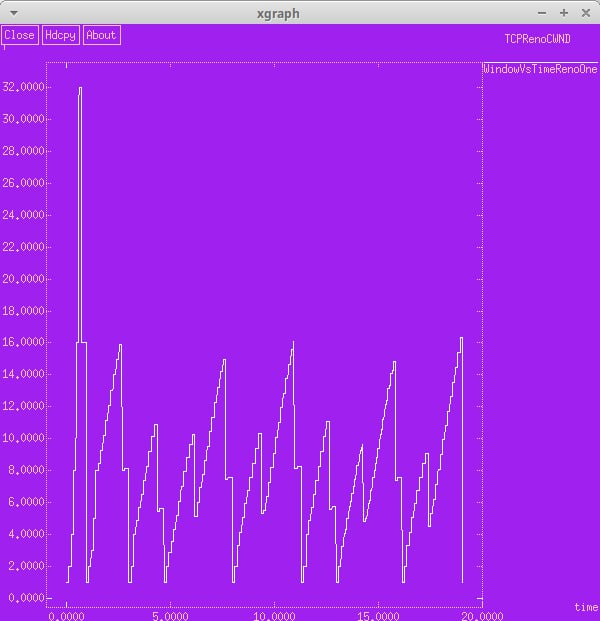
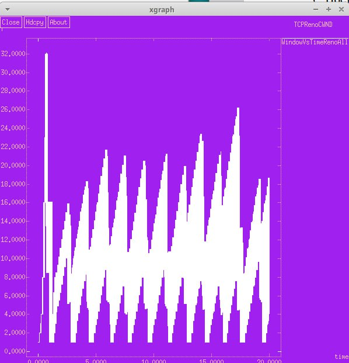
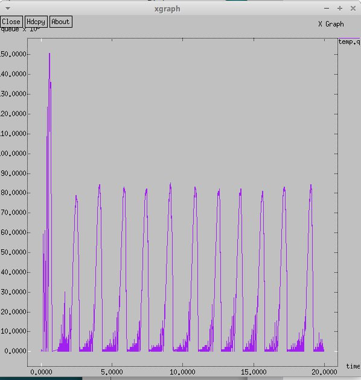
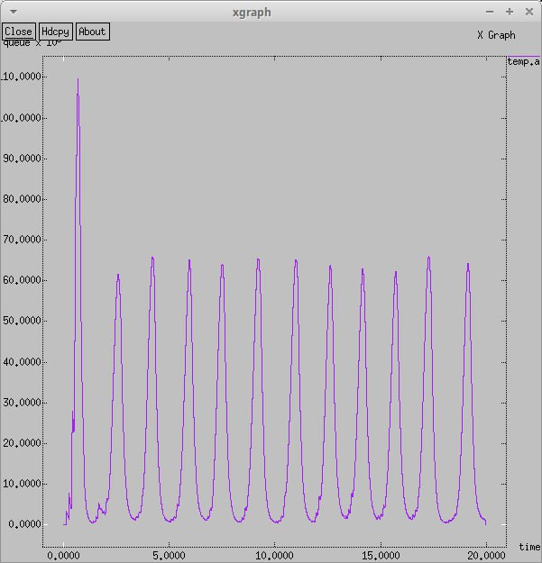
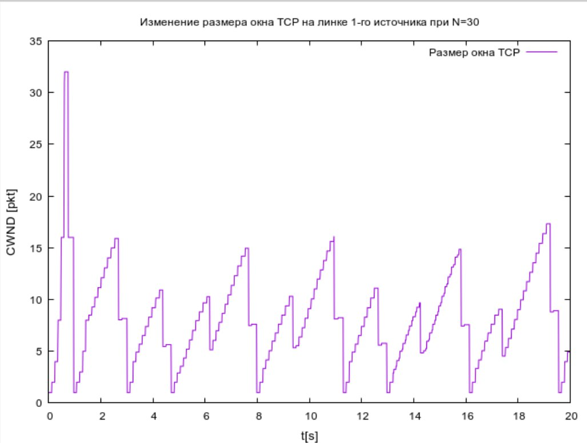
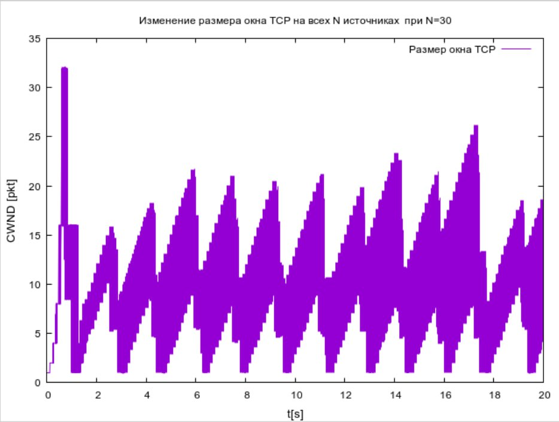
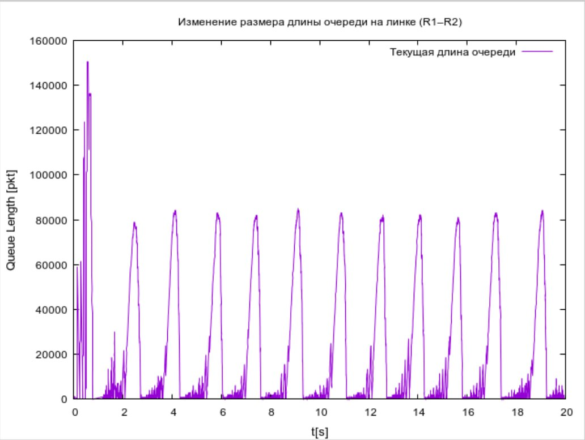
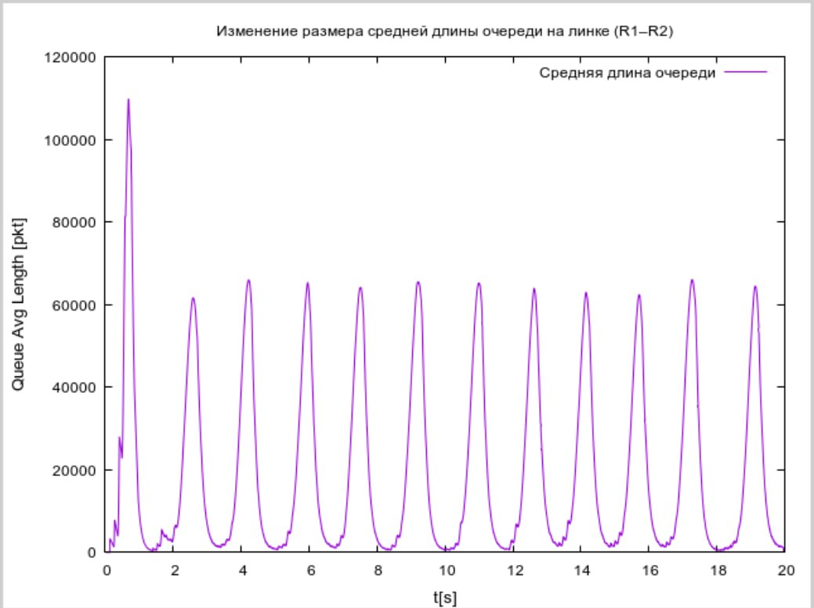

---
## Front matter
lang: ru-RU
title: Лабораторная работа №4
subtitle: Имитационное моделирование
author:
  - Шошина Е.А.
institute:
  - Российский университет дружбы народов, Москва, Россия
  - Объединённый институт ядерных исследований, Дубна, Россия
date: 16 июня 2025

## i18n babel
babel-lang: russian
babel-otherlangs: english

## Formatting pdf
toc: false
toc-title: Содержание
slide_level: 2
aspectratio: 169
section-titles: true
theme: metropolis
header-includes:
 - \metroset{progressbar=frametitle,sectionpage=progressbar,numbering=fraction}
---

# Информация

## Докладчик

:::::::::::::: {.columns align=center}
::: {.column width="70%"}

  * Шошина Евгения Александровна
  * Студентка 3го курса, группа НФИбд-01-22
  * Фундаментальная информатика и информационные технологии
  * Российский университет дружбы народов
  * [Ссылка на репозиторий гитхаба eashoshina](https://github.com/eashoshina/study_2024-2025_simmod)

:::
::: {.column width="30%"}


:::
::::::::::::::

## Цель

Выполнить задание для самостоятельного выполнения.

## Задание

1. Для приведённой схемы разработать имитационную модель в пакете NS-2.
2. Построить график изменения размера окна TCP (в Xgraph и в GNUPlot);
3. Построить график изменения длины очереди и средней длины очереди на первом маршрутизаторе.
4. Оформить отчёт о выполненной работе.

## Теоретическое введение

- сеть состоит из N TCP-источников, N TCP-приёмников, двух маршрутизаторов R1 и R2 между источниками и приёмниками (N — не менее 20);
- между TCP-источниками и первым маршрутизатором установлены дуплексные соединения с пропускной способностью 100 Мбит/с и задержкой 20 мс очередью типа DropTail;
- между TCP-приёмниками и вторым маршрутизатором установлены дуплексные соединения с пропускной способностью 100 Мбит/с и задержкой 20 мс очередью типа DropTail;
- между маршрутизаторами установлено симплексное соединение (R1–R2) с пропускной способностью 20 Мбит/с и задержкой 15 мс очередью типа RED, размером буфера 300 пакетов; в обратную сторону — симплексное соединение (R2–R1) с пропускной способностью 15 Мбит/с и задержкой 20 мс очередью типа DropTail;
- данные передаются по протоколу FTP поверх TCPReno;
- параметры алгоритма RED: qmin = 75, qmax = 150, qw = 0, 002, pmax = 0.1;
- максимальный размер TCP-окна 32; размер передаваемого пакета 500 байт; время моделирования — не менее 20 единиц модельного времени.

# Выполнение лабораторной работы
## 1. Для приведённой схемы разработали имитационную модель в пакете NS-2
```
Agent/TCP set window_ 32
Agent/TCP set pktSize_ 500
```
## 1. Для приведённой схемы разработали имитационную модель в пакете NS-2

```
set r1 [$ns node]
set r2 [$ns node]

$ns simplex-link $r1 $r2 20Mb 15ms RED
$ns simplex-link $r2 $r1 15Mb 20ms DropTail
$ns queue-limit $r1 $r2 300

set N 30
for {set i 0} {$i < $N} {incr i} {
  set n1($i) [$ns node]
  $ns duplex-link $n1($i) $r1 100Mb 20ms DropTail
  set n2($i) [$ns node]
  $ns duplex-link $n2($i) $r2 100Mb 20ms DropTail

  set tcp($i) [$ns create-connection TCP/Reno $n1($i) TCPSink $n2($i) $i]
  set ftp($i) [$tcp($i) attach-source FTP]
}

```
## 1. Для приведённой схемы разработали имитационную модель в пакете NS-2

```
# Мониторинг размера окна TCP:
set windowVsTimeOne [open WindowVsTimeRenoOne w]
puts $windowVsTimeOne "0.Color: White"
set windowVsTimeAll [open WindowVsTimeRenoAll w]
puts $windowVsTimeAll "0.Color: White"

set qmon [$ns monitor-queue $r1 $r2 [open qm.out w] 0.1];
[$ns link $r1 $r2] queue-sample-timeout;

```
## 1. Для приведённой схемы разработали имитационную модель в пакете NS-2

```
# Мониторинг очереди:
set redq [[$ns link $r1 $r2] queue]
$redq set thresh_ 75
$redq set maxthresh_ 150
$redq set q_weight_ 0.002
$redq set linterm_ 10

set tchan_ [open all.q w]
$redq trace curq_
$redq trace ave_
$redq attach $tchan_

for {set i 0} {$i < $N} {incr i} {
  $ns at 0.0 "$ftp($i) start"
  $ns at 0.0 "plotWindow $tcp($i) $windowVsTimeAll"
}

$ns at 0.0 "plotWindow $tcp(1) $windowVsTimeOne"
```

## 2. Построили графики изменения размера окна TCP и построили графики изменения длины очереди и средней длины очереди на первом маршрутизаторе в Xgraph.

{#fig:001 width=50%}

{#fig:002 width=50%}

{#fig:003 width=50%}

{#fig:004 width=50%}

## 2. Построили графики изменения размера окна TCP и построили графики изменения длины очереди и средней длины очереди на первом маршрутизаторе в GNUPlot.

{#fig:005 width=50%}

{#fig:006 width=50%}

{#fig:007 width=50%}

{#fig:008 width=50%}

# Выводы

Выполнили задание для самостоятельного выполнения.

# Список литературы{.unnumbered}

1. https://ieeexplore.ieee.org/document/1019265
2. https://redos.red-soft.ru/base/redos-8_0/8_0-network/8_0-sett-network/
3. https://asvk.cs.msu.ru/~sveta/CN_lecture_4.pdf

