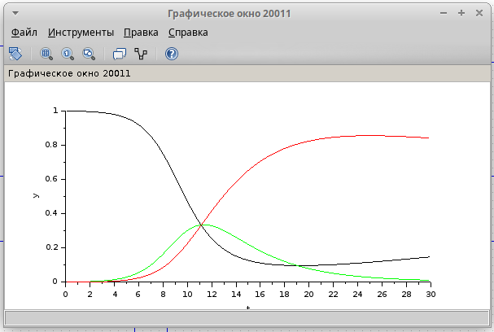
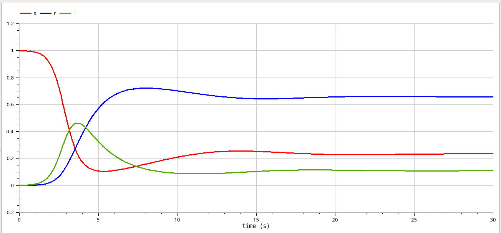

---
## Front matter
lang: ru-RU
title: "Лабораторная работа №5. Модель эпидемии (SIR)"
subtitle: "Дисциплина: Имитационное моделирование"
author:
  - Шошина Е.А.
institute:
  - Группа НФИбд-01-22
  - Российский университет дружбы народов, Москва, Россия
date: 12 апреля 2025

## i18n babel
babel-lang: russian
babel-otherlangs: english

## Formatting pdf
toc: false
toc-title: Содержание
slide_level: 2
aspectratio: 169
section-titles: true
theme: metropolis
header-includes:
 - \metroset{progressbar=frametitle,sectionpage=progressbar,numbering=fraction}
 - '\makeatletter'
 - '\beamer@ignorenonframefalse'
 - '\makeatother'
---

# Информация

## Докладчик

:::::::::::::: {.columns align=center}
::: {.column width="70%"}

  * Шошина Евгения Александровна
  * Студентка 3го курса, группа НФИбд-01-22
  * Фундаментальная информатика и информационные технологии
  * Российский университет дружбы народов
  * [Ссылка на репозиторий гитхаба EAShoshina](https://github.com/eashoshina/study_2024-2025_simmod)

:::
::: {.column width="30%"}

:::
::::::::::::::
# Вводная часть

## Цели и задачи

Выполнить задания и получить практические навыки работы со средствами моделирования xcos, Modelica и OpenModelica. Рассмотреть модель эпидемии (SIR).

## Задание

1. Реализовать имитационную модель эпидемии в xcos;
2. Реализовать имитационную модель эпидемии в Modelica;
3. Реализовать имитационную модель эпидемии в OpenModelica (упражнение);
4. Выполнить задание для самостоятельной работы.

# Выполнение лабораторной работы

# Реализация модели в xcos

## Задали начальные параметры 
{#fig:001 width=70%}

## Построили Модель SIR в xcos
{#fig:002 width=70%}

## Получили график

{#fig:003 width=70%}

# Реализация модели с помощью блока Modelica в xcos

## Построили Модель SIR в xcos с применением блока Modelica

{#fig:004 width=70%}

## Задали начальные параметры модели с помощью блока Modelica в xcos

{#fig:005 width=70%}

{#fig:006 width=70%}

## Получили аналогичный первому графику "Эпидемический порог модели SIR"

{#fig:007 width=70%}

# Упражнение. Реализация модели SIR в OpenModelica

## Написали программный код в OpenModelica

{#fig:008 width=70%}

## Получили аналогичный первому и второму графику "Эпидемический порог модели SIR"

{#fig:009 width=70%}

# Задание для самостоятельной работы

## Реализация модели в xcos

{#fig:010 width=70%}

{#fig:003 width=70%}

## Реализация модели с помощью блока Modelica в xcos 

{#fig:012 width=70%}

## Задали начальные параметры модели с помощью блока Modelica в xcos

{#fig:013 width=70%}

## Задали начальные параметры модели с помощью блока Modelica в xcos

{#fig:014 width=70%}

## Задали начальные параметры модели с помощью блока Modelica в xcos

{#fig:016 width=70%}

# Реализация модели в OpenModelica

## Написали программный код в OpenModelica

{#fig:017 width=70%}

## Получили график "Эпидемический порог модели SIR"

{#fig:018 width=70%}

# Графики эпидемического порога при различных значениях параметров модели

## Изменение динамики при изменяющемся коэффициенте рождаемости/ гибели mu

{#fig:019 width=70%}

## Изменение динамики при изменяющемся коэффициенте рождаемости/ гибели mu

{#fig:020 width=70%}

# Результаты

Я получила практические навыки работы со средствами моделирования xcos, Modelica и OpenModelica. Была рассмотрена модель эпидемии (SIR).
