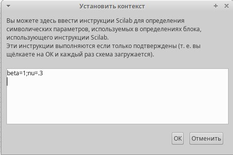
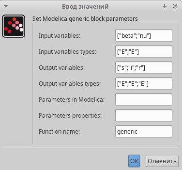
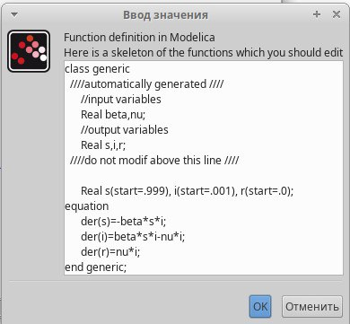
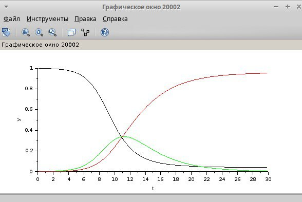
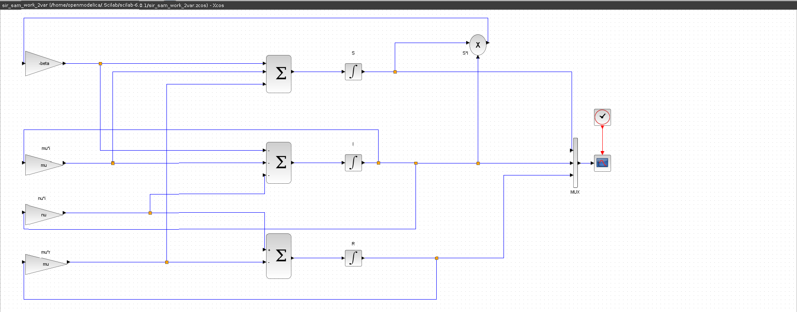
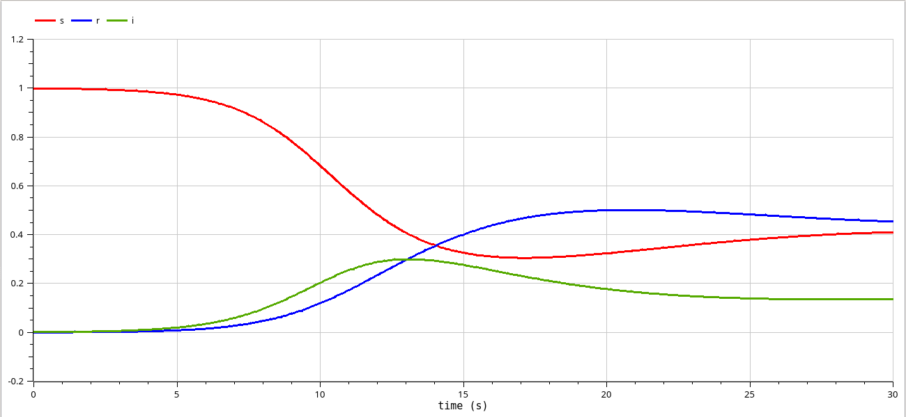

---
## Front matter
title: "Отчёт по лабораторной работе №5"
subtitle: "Дисциплина: Имитационное моделирование"
author: "Шошина Евгения(НФИ-01-22)"

## Generic otions
lang: ru-RU
toc-title: "Содержание"

## Bibliography
bibliography: bib/cite.bib
csl: pandoc/csl/gost-r-7-0-5-2008-numeric.csl

## Pdf output format
toc: true # Table of contents
toc-depth: 2
lof: true # List of figures
lot: true # List of tables
fontsize: 12pt
linestretch: 1.5
papersize: a4
documentclass: scrreprt
## I18n polyglossia
polyglossia-lang:
  name: russian
  options:
	- spelling=modern
	- babelshorthands=true
polyglossia-otherlangs:
  name: english
## I18n babel
babel-lang: russian
babel-otherlangs: english
## Fonts
mainfont: PT Serif
romanfont: PT Serif
sansfont: PT Sans
monofont: PT Mono
mainfontoptions: Ligatures=TeX
romanfontoptions: Ligatures=TeX
sansfontoptions: Ligatures=TeX,Scale=MatchLowercase
monofontoptions: Scale=MatchLowercase,Scale=0.9
## Biblatex
biblatex: true
biblio-style: "gost-numeric"
biblatexoptions:
  - parentracker=true
  - backend=biber
  - hyperref=auto
  - language=auto
  - autolang=other*
  - citestyle=gost-numeric
## Pandoc-crossref LaTeX customization
figureTitle: "Рис."
tableTitle: "Таблица"
listingTitle: "Листинг"
lofTitle: "Список иллюстраций"
lotTitle: "Список таблиц"
lolTitle: "Листинги"
## Misc options
indent: true
header-includes:
  - \usepackage{indentfirst}
  - \usepackage{float} # keep figures where there are in the text
  - \floatplacement{figure}{H} # keep figures where there are in the text
---

# Цель работы

Выполнить задания и получить практические навыки работы со средствами моделирования xcos, Modelica и OpenModelica. Рассмотреть модель эпидемии (SIR).

# Задание

1. Реализовать имитационную модель эпидемии в xcos;
2. Реализовать имитационную модель эпидемии в Modelica;
3. Реализовать имитационную модель эпидемии в OpenModelica (упражнение);
4. Выполнить задание для самостоятельной работы.

# Теоретическое введение

Модель SIR предложена в 1927 г. (W. O. Kermack, A. G. McKendrick).
Предполагается, что особи популяции размера N могут находиться в трёх различных состояниях:

- S (susceptible, уязвимые) — здоровые особи, которые находятся в группе риска
и могут подхватить инфекцию;
- I (infective, заражённые, распространяющие заболевание) — заразившиеся переносчики болезни;
- R (recovered/removed, вылечившиеся) — те, кто выздоровел и перестал распространять болезнь (в эту категорию относят, например, приобретших иммунитет или умерших).

Внутри каждой из выделенных групп особи считаются неразличимыми по свойствам. Типичная эволюция особи популяции описывается следующей диаграммой:

*S->I->R*

Считаем, что система замкнута, т.е. N=S+I+R. [@lab_ruk].

# Выполнение лабораторной работы

## Повторим пример из лабораторной работы

### Реализация модели в xcos

Зайдя в среду моделирования Xcos начала выполнять учебный пример. В начале во вкладке "Моделирование" открыла "Установить контекст" и задала переменные $\beta = 1$, $\nu = 0.3$ (рис. @fig:001).

{#fig:001 width=70%}

Далее я реализовала модель при помощи следующих блоков xcos(рис. @fig:002):

$$
\begin{cases}
  \dot s = - \beta s(t)i(t); \\
  \dot i = \beta s(t)i(t) - \nu i(t);\\
  \dot r = \nu i(t),
\end{cases}
$$

- CLOCK_c — запуск часов модельного времени;
- CSCOPE — регистрирующее устройство для построения графика;
- TEXT_f — задаёт текст примечаний;
- MUX — мультиплексер, позволяющий в данном случае вывести на графике сразу
несколько кривых;
- INTEGRAL_m — блок интегрирования:
- GAINBLK_f — в данном случае позволяет задать значения коэффициентов $\beta$ и $\nu$;
- SUMMATION — блок суммирования;
- PROD_f — поэлементное произведение двух векторов на входе блока.

{#fig:002 width=70%}

{#fig:003 width=70%}

### Реализация модели с помощью блока Modelica в xcos

Для реализации модели с помощью языка Modelica помимо блоков `CLOCK_c`, `CSCOPE`, `TEXT_f` и `MUX` требуются блоки:

- `CONST_m` — задаёт константу; 
- `MBLOCK` (Modelica generic) — блок реализации кода на языке Modelica.

{#fig:004 width=70%}

Задали параметры блока Modelica

{#fig:005 width=70%}

{#fig:006 width=70%}

Получили аналогичный первому графику "Эпидемический порог модели SIR"

{#fig:007 width=70%}
 
## Упражнение. Реализация модели SIR в OpenModelica

Написали программный код на в OpenModelica

{#fig:008 width=70%}

Получили аналогичный первому и второму графику "Эпидемический порог модели SIR"

{#fig:009 width=70%}

## Задание для самостоятельной работы

Предположим, что в модели SIR учитываются демографические процессы, в частности, что смертность в популяции полностью уравновешивает рождаемость, а все рожденные индивидуумы появляются на свет абсолютно здоровыми. Тогда получим следующую систему уравнений:

$$
\begin{cases}
  \dot s = - \beta s(t)i(t) + \mu (N - s(t)); \\
  \dot i = \beta s(t)i(t) - \nu i(t) - \mu i(t);\\
  \dot r = \nu i(t) - \mu r(t),
\end{cases}
$$

где $\mu$ — константа, которая равна коэффициенту смертности и рождаемости.

### Реализация модели в xcos

Построили модель SIR в xcos с учетом процесса рождения/гибели особей

{#fig:010 width=70%}

{#fig:003 width=70%}

### Реализация модели с помощью блока Modelica в xcos (2 варианта)

Формула выглядит следующим образом: 

$$- \beta s(t)i(t) + \mu (N - s(t))$$

Но в начале мы говорили, что $N = S+I+R$, значит, можно вывести следующее:

$$N-S = I+R$$

Используем это для построения модели 

{#fig:012 width=70%}

{#fig:013 width=70%}

{#fig:014 width=70%}

{#fig:016 width=70%}

### Реализация модели в OpenModelica

Написали программный код на в OpenModelica

{#fig:017 width=70%}

{#fig:018 width=70%}

### Графики эпидемического порога при различных значениях параметров модели

**Изменение $\beta$ (скорости заражения):**

Параметр $\beta$ (скорость заражения) оказывает существенное влияние на динамику эпидемии. Чем выше $\beta$, тем быстрее распространяется болезнь и тем больше людей заражается.
  
* **$\beta$ = 3:** Высокая скорость заражения приводит к быстрому распространению эпидемии. Число инфицированных быстро растет, достигает пика, а затем снижается.

* **$\beta$ = 1:** Низкая скорость заражения приводит к медленному или незначительному распространению эпидемии. Число инфицированных остается низким или постепенно увеличивается.
    
**Изменение $\nu$ (скорости выздоровления):**

Более высокая скорость выздоровления способствует быстрому снижению числа инфицированных после пика.

* **Изменение $\mu$ (коэффициента смертности и рождаемости):**

В самых базовых моделях SIR (Susceptible - восприимчивые, Infected - инфицированные, Recovered - выздоровевшие), которые часто используются для начального анализа, рождаемость и смертность (и, следовательно, параметр $\mu$) обычно не учитываются. Это делается для упрощения модели и сосредоточения внимания на динамике распространения инфекции. В таких моделях население считается постоянным.

* **$\mu$ = 1:** Высокий коэффициент $\mu$ приводит к быстрому обороту популяции, что предотвращает распространение эпидемии.

* **$\mu$ = 0.5:** Средний коэффициент $\mu$ позволяет эпидемии распространяться медленно.

* **$\mu$ = 0.1:** Низкий коэффициент $\mu$ позволяет эпидемии распространяться быстрее, но в совокупности с изменениями других коэффициентов быстрый рост сопровождается и быстрым ростом "переболевших".

**$\beta$ = 3, $\nu$ = 0.6, $\mu$ = 0.1**
  
* Начальная популяция восприимчивых быстро уменьшается, поскольку болезнь распространяется.
* Число инфицированных быстро растет, достигая пика, а затем постепенно снижается.
* Число выздоровевших увеличивается и стабилизируется на определенном уровне.
* Система достигает состояния равновесия, где популяция восприимчивых стабилизируется на уровне около 0.25, инфицированных - на уровне около 0.1, а выздоровевших - на уровне около 0.65.

**$\beta$ = 1, $\nu$ = 0.3, $\mu$ = 1**
  
* Число восприимчивых остается неизменным.
* Число инфицированных остается очень низким.
* Число выздоровевших также остается неизменным.
* Болезнь не может распространиться.

**$\beta$ = 1, $\nu$ = 0.3, $\mu$ = 0.5**

* Число восприимчивых немного уменьшается.
* Число инфицированных остается низким, но постепенно увеличивается.
* Число выздоровевших также постепенно увеличивается.
    
**$\beta$ = 1, $\nu$ = 0.3, $\mu$ = 0.1**
    
* Начальная популяция восприимчивых значительно уменьшается.
* Число инфицированных быстро растет, достигая пика, а затем снижается.
* Число выздоровевших увеличивается и стабилизируется на определенном уровне.
* Система достигает состояния равновесия, где популяция восприимчивых стабилизируется на уровне около 0.4, инфицированных - на уровне около 0.17, а выздоровевших - на уровне около 0.45.

{#fig:019 width=70%}

{#fig:020 width=70%}

# Выводы

Я получила практические навыки работы со средствами моделирования xcos, Modelica и OpenModelica. Была рассмотрена модель эпидемии (SIR).

# Список литературы{.unnumbered}

::: {#refs}
:::
