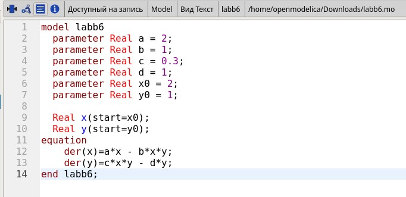

---
## Front matter
lang: ru-RU
title: "Отчет по 6 лабораторной работе"
subtitle: "Дисциплина: Имитационное моделирование"
author:
  - Шошина Е.А.
institute:
  - Группа НФИбд-01-22
  - Российский университет дружбы народов, Москва, Россия
date: 13 марта 2025

## i18n babel
babel-lang: russian
babel-otherlangs: english

## Formatting pdf
toc: false
toc-title: Содержание
slide_level: 2
aspectratio: 169
section-titles: true
theme: metropolis
header-includes:
  - \metroset{progressbar=frametitle,sectionpage=progressbar,numbering=fraction}
  - '\makeatletter'
  - '\beamer@ignorenonframefalse'
  - '\makeatother'
---

# Информация

## Докладчик

:::::::::::::: {.columns align=center}
::: {.column width="70%"}

  * Шошина Евгения Александровна
  * Студентка 3го курса, группа НФИбд-01-22
  * Фундаментальная информатика и информационные технологии
  * Российский университет дружбы народов
  * [Ссылка на репозиторий гитхаба EAShoshina](https://github.com/eashoshina/study_2024-2025_simmod)

:::
::: {.column width="30%"}

:::
::::::::::::::

# Вводная часть

## Цель

Целью лабораторной работы №6 была реализация модели «хищник – жертва», которая представляет собой модель межвидовой конкуренции, в xcos, с помощью блока Modelica в xcos и в OpenModelica.

## Задачи

- Реализовать модель «хищник – жертва» в xcos.
- Реализовать модель «хищник – жертва» с помощью блока Modelica в xcos.
- Реализовать модель «хищник – жертва» в OpenModelica.

## Теоретическое введение

Модель «хищник–жертва» (модель Лотки — Вольтерры) представляет собой модель межвидовой конкуренции. В математической форме модель имеет вид:

$$
\begin{cases}
  \dot x = ax - bxy \\
  \dot y = cxy - dy,
\end{cases}
$$

где \(x\) — количество жертв; \(y\) — количество хищников; \(a, b, c, d\) — коэффициенты, отражающие взаимодействия между видами: \(a\) — коэффициент рождаемости жертв; \(b\) — коэффициент убыли жертв; \(c\) — коэффициент рождения хищников; \(d\) — коэффициент убыли хищников. [@lab_ruk]

---

# Выполнение лабораторной работы

## Реализация модели в xcos

### Задали переменные окружения

{#fig:001 width=70%}

### Построили модель «хищник – жертва» в xcos

Для реализации модели (рис. @fig:001) использовали блоки: CLOCK_c, CSCOPE, TEXT_f, MUX, INTEGRAL_m, GAINBLK_f, SUMMATION, PROD_f и CSCOPXY.

{#fig:002 width=70%}

### В параметрах блоков интегрирования задали начальные значения

x(0) = 2, y(0) = 1 (рис. @fig:003 и рис. @fig:004)

{#fig:003 width=70%}

{#fig:004 width=70%}

### Задали конечное время интегрирования, равным времени моделирования: 30

{#fig:005 width=70%}

---

## Реализация модели с помощью блока Modelica в xcos

### Построили модель «хищник – жертва» с помощью языка Modelica в xcos

Для реализации модели «хищник–жертва» с помощью языка Modelica использовали следующие блоки xcos: CLOCK_c, CSCOPE, CSCOPXY, TEXT_f, MUX, CONST_m и MBLOCK (Modelica generic).

{#fig:006 width=70%}

{#fig:007 width=70%}

---

## Реализация модели в OpenModelica

### Создала класс и написала программу в OpenModelica

{#fig:010 width=70%}

### Построила график изменения численности популяций

{#fig:011 width=70%}

{#fig:012 width=70%}

---

## Выводы

Реализовала модель «хищник–жертва» (модель Лотки — Вольтерры), которая представляет собой модель межвидовой конкуренции в xcos, с помощью блока Modelica в xcos и в OpenModelica.
