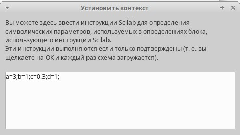
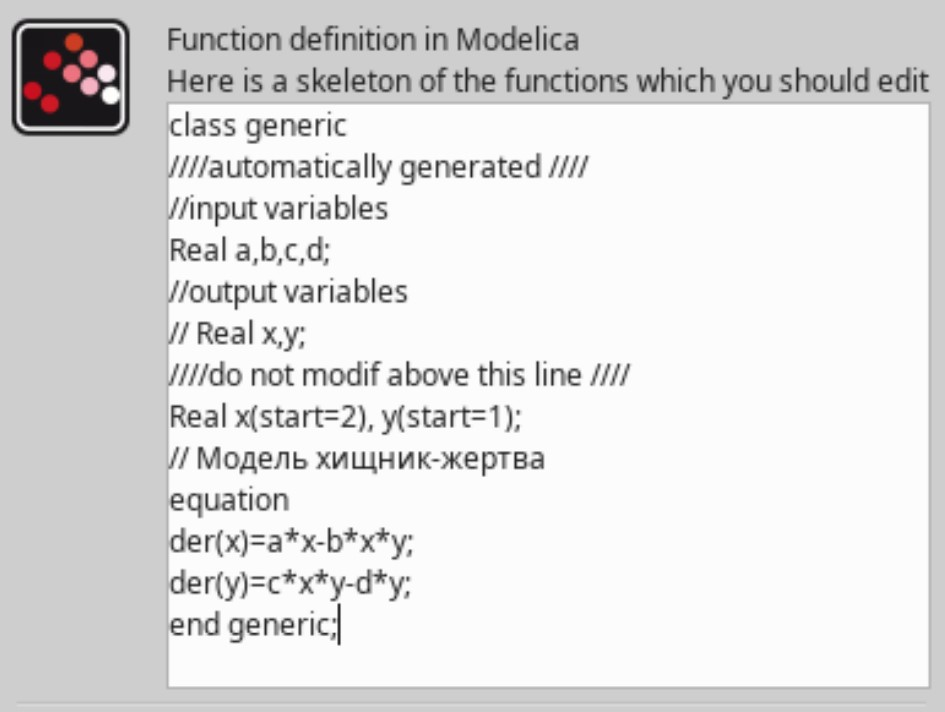
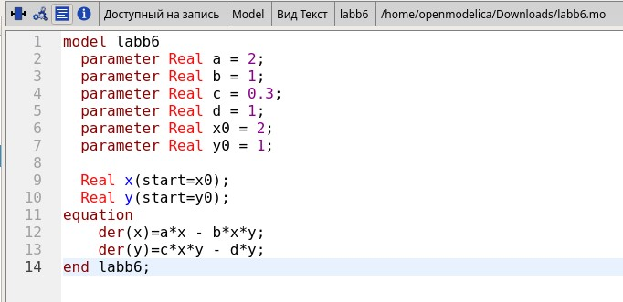
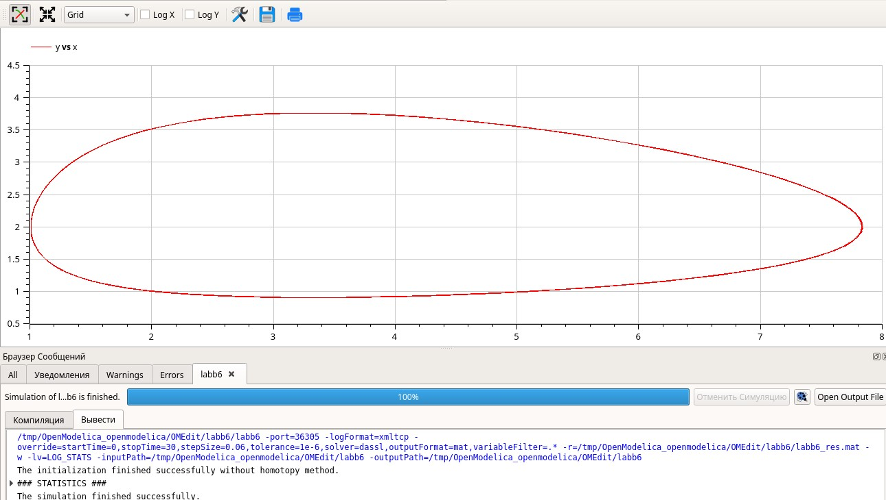

---
## Front matter
title: "Отчет по Лабораторной работе №6"
subtitle: "Дисциплина: Имитационное моделирование"
author: "Шошина Евгения Александровна, НФИ-01-22"

## Generic otions
lang: ru-RU
toc-title: "Содержание"

## Bibliography
bibliography: bib/cite.bib
csl: pandoc/csl/gost-r-7-0-5-2008-numeric.csl

## Pdf output format
toc: true # Table of contents
toc-depth: 2
lof: true # List of figures
lot: true # List of tables
fontsize: 12pt
linestretch: 1.5
papersize: a4
documentclass: scrreprt
## I18n polyglossia
polyglossia-lang:
  name: russian
  options:
	- spelling=modern
	- babelshorthands=true
polyglossia-otherlangs:
  name: english
## I18n babel
babel-lang: russian
babel-otherlangs: english
## Fonts
mainfont: PT Serif
romanfont: PT Serif
sansfont: PT Sans
monofont: PT Mono
mainfontoptions: Ligatures=TeX
romanfontoptions: Ligatures=TeX
sansfontoptions: Ligatures=TeX,Scale=MatchLowercase
monofontoptions: Scale=MatchLowercase,Scale=0.9
## Biblatex
biblatex: true
biblio-style: "gost-numeric"
biblatexoptions:
  - parentracker=true
  - backend=biber
  - hyperref=auto
  - language=auto
  - autolang=other*
  - citestyle=gost-numeric
## Pandoc-crossref LaTeX customization
figureTitle: "Рис."
tableTitle: "Таблица"
listingTitle: "Листинг"
lofTitle: "Список иллюстраций"
lotTitle: "Список таблиц"
lolTitle: "Листинги"
## Misc options
indent: true
header-includes:
  - \usepackage{indentfirst}
  - \usepackage{float} # keep figures where there are in the text
  - \floatplacement{figure}{H} # keep figures where there are in the text
---

# Цель работы

Реализовать модель «хищник – жертва», которая представляет собой модель межвидовой конкуренции, в xcos, с помощью блока Modelica в xcos и в OpenModelica.

# Задание

1. Реализовать модель «хищник – жертва» в xcos.
2. Реализовать модель «хищник – жертва» с помощью блока Modelica в xcos.
3. Реализовать модель «хищник – жертва» в OpenModelica.

# Теоретическое введение

Модель «хищник–жертва» (модель Лотки — Вольтерры) представляет собой модель межвидовой конкуренции. В математической форме модель имеет вид:

$$
\begin{cases}
  \dot x = ax - bxy \\
  \dot y = cxy - dy,
\end{cases}
$$

где $x$ — количество жертв; $y$ — количество хищников; $a, b, c, d$ — коэффициенты, отражающие взаимодействия между видами: $a$ — коэффициент рождаемости
жертв; $b$ — коэффициент убыли жертв; $c$ — коэффициент рождения хищников; $d$ —
коэффициент убыли хищников. [@lab_ruk]

# Выполнение лабораторной работы

## Реализация модели в xcos

В начале зафиксировали начальные данные: a = 2, b = 1, c = 0, 3, d = 1, x(0) = 2, y(0) = 1. Задали переменные окружения (рис. @fig:001, @fig:002, @fig:003, @fig:004, @fig:005). 

{#fig:001 width=70%}

Построили модель «хищник – жертва» в xcos. Для реализации модели (рис.1)использовали блоки: CLOCK_c, CSCOPE, TEXT_f,
MUX, INTEGRAL_m, GAINBLK_f, SUMMATION, PROD_f и CSCOPXY.

{#fig:002 width=70%}

В параметрах блоков интегрирования задали начальные значения
x(0) = 2, y(0) = 1 (рис.3_1 и рис.3_2)

{#fig:003 width=70%}

{#fig:004 width=70%}

Задали конечное время интегриования, равным времени моделирования: 30.
Результат моделирования представлен на рис.5.

{#fig:005 width=70%}

## Реализация модели с помощью блока Modelica в xcos.

Для реализации модели «хищник–жертва» с помощью языка Modelica использовали следующие блоки xcos: CLOCK_c, CSCOPE, CSCOPXY, TEXT_f, MUX, CONST_m и MBLOCK (Modelica generic).
Как и ранее, задали значения коэффициентов a, b, c, d.
Готовая модель «хищник–жертва» представлена на рис.6.
Параметры блока Modelica представлены на рис.7_1 и рис.7_2. Переменные на входе (“a”,“b”, “c”, “d”) и выходе (“x”, “y”) блока заданы как внешние (“E”).

{#fig:006 width=70%}

{#fig:007 width=70%}

{#fig:008 width=70%}

{#fig:009 width=70%}

## Реализация модели в OpenModelica.

Создала класс и написала программу в OpenModelica.

{#fig:010 width=70%}

Построила график изменения численности популяций.

{#fig:011 width=70%}

{#fig:012 width=70%}

# Выводы

Реализовала модель «хищник–жертва» (модель Лотки — Вольтерры), которая представляет собой модель межвидовой конкуренции в xcos, с помощью блока Modelica в xcos и в OpenModelica.

# Список литературы{.unnumbered}

::: {#refs}
:::
