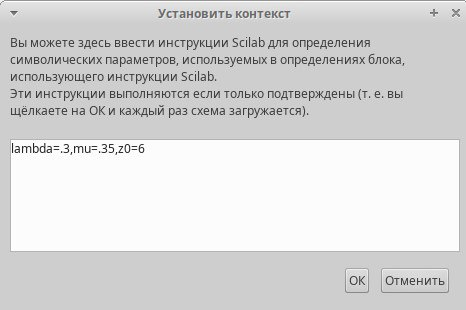
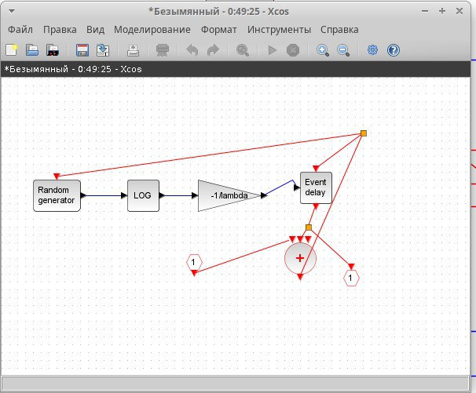
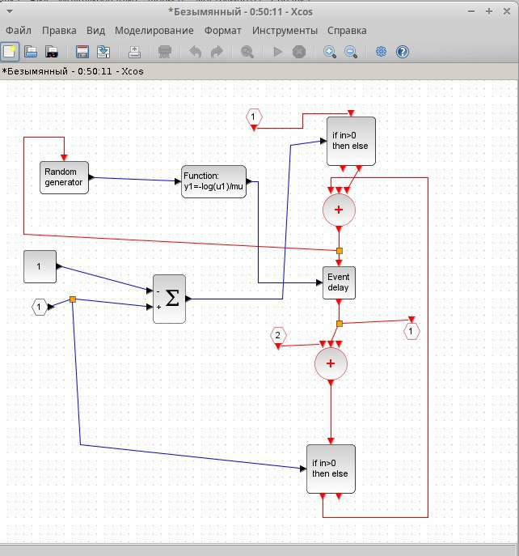
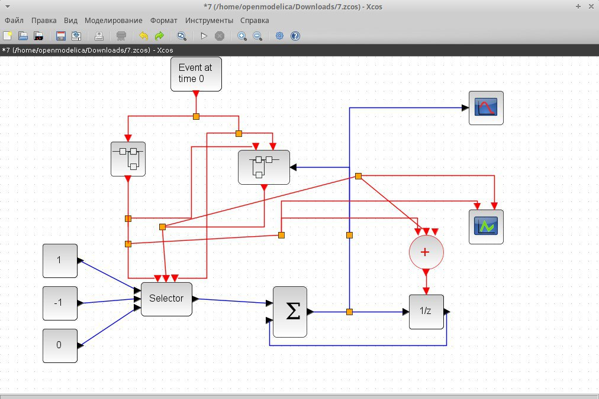

---
## Front matter
lang: ru-RU
title: "Отчет по 7 лабораторной работе"
subtitle: "Дисциплина: Имитационное моделирование"
author:
  - Шошина Е.А.
institute:
  - Группа НФИбд-01-22
  - Российский университет дружбы народов, Москва, Россия
date: 22 марта 2025

## i18n babel
babel-lang: russian
babel-otherlangs: english

## Formatting pdf
toc: false
toc-title: Содержание
slide_level: 2
aspectratio: 169
section-titles: true
theme: metropolis
header-includes:
  - \metroset{progressbar=frametitle,sectionpage=progressbar,numbering=fraction}
  - '\makeatletter'
  - '\beamer@ignorenonframefalse'
  - '\makeatother'
---

# Информация

## Докладчик

:::::::::::::: {.columns align=center}
::: {.column width="70%"}

  * Шошина Евгения Александровна
  * Студентка 3го курса, группа НФИбд-01-22
  * Фундаментальная информатика и информационные технологии
  * Российский университет дружбы народов
  * [Ссылка на репозиторий гитхаба EAShoshina](https://github.com/eashoshina/study_2024-2025_simmod)

:::
::: {.column width="30%"}

:::
::::::::::::::

# Вводная часть

## Цель

Создать модель в xcos системы массового обслуживания типа \( M|M|1|\infty \).

## Задание

1. Создать суперблок, моделирующий поступление заявок.
2. Создать суперблок,моделирующий обработку заявок.
3. Создать модель \( M|M|1|\infty \).

## Теоретическое введение

Модель массового обслуживания \( M|M|1|\infty \) в среде Xcos (части Scilab) представляет собой однофазную систему обслуживания с одной очередью и одним каналом обслуживания. Вот основные характеристики этой модели:

Обозначения и основные параметры
- \( M|M|1|\infty \):  
  - Первый \( M \): Входной поток событий (заявок) поступает по пуассоновскому распределению.
  - Второй \( M \): Время обслуживания заявок распределено экспоненциально.
  - \( 1 \): Один канал обслуживания.
  - \( \infty \): Неограниченная длина очереди (потенциально бесконечная).

# Выполнение лабораторной работы

## Реализация модели в xcos. Задали переменные окружения.
В начале зафиксировали начальные данные: lambda=0.3, mu=0.35,z0=6. Задали переменные окружения.

{#fig:001 width=50%}

## Создали суперблок, моделирующий поступление заявок.

{#fig:002 width=40%}

## Создали суперблок, моделирующий поступление заявок.

{#fig:003 width=50%}

## Создали модель в xcos системы массового обслуживания.

{#fig:004 width=70%}

## Выводы

Создала модель в xcos системы массового обслуживания типа \( M|M|1|\infty \).
