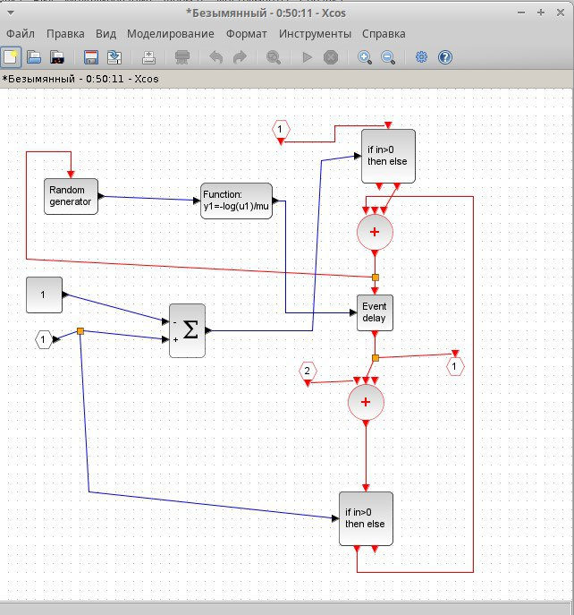

---
## Front matter
title: "Отчет по Лабораторной работе №7"
subtitle: "Дисциплина: Имитационное моделирование"
author: "Шошина Евгения Александровна, НФИ-01-22"

## Generic otions
lang: ru-RU
toc-title: "Содержание"

## Bibliography
bibliography: bib/cite.bib
csl: pandoc/csl/gost-r-7-0-5-2008-numeric.csl

## Pdf output format
toc: true # Table of contents
toc-depth: 2
lof: true # List of figures
lot: true # List of tables
fontsize: 12pt
linestretch: 1.5
papersize: a4
documentclass: scrreprt
## I18n polyglossia
polyglossia-lang:
  name: russian
  options:
	- spelling=modern
	- babelshorthands=true
polyglossia-otherlangs:
  name: english
## I18n babel
babel-lang: russian
babel-otherlangs: english
## Fonts
mainfont: PT Serif
romanfont: PT Serif
sansfont: PT Sans
monofont: PT Mono
mainfontoptions: Ligatures=TeX
romanfontoptions: Ligatures=TeX
sansfontoptions: Ligatures=TeX,Scale=MatchLowercase
monofontoptions: Scale=MatchLowercase,Scale=0.9
## Biblatex
biblatex: true
biblio-style: "gost-numeric"
biblatexoptions:
  - parentracker=true
  - backend=biber
  - hyperref=auto
  - language=auto
  - autolang=other*
  - citestyle=gost-numeric
## Pandoc-crossref LaTeX customization
figureTitle: "Рис."
tableTitle: "Таблица"
listingTitle: "Листинг"
lofTitle: "Список иллюстраций"
lotTitle: "Список таблиц"
lolTitle: "Листинги"
## Misc options
indent: true
header-includes:
  - \usepackage{indentfirst}
  - \usepackage{float} # keep figures where there are in the text
  - \floatplacement{figure}{H} # keep figures where there are in the text
---

# Цель работы

Создать модель в xcos системы массового обслуживания типа \( M|M|1|\infty \).

# Задание

1. Создать суперблок, моделирующий поступление заявок.
2. Создать суперблок,моделирующий обработку заявок.
3. Создать модель \( M|M|1|\infty \).

# Теоретическое введение

Модель массового обслуживания \( M|M|1|\infty \) в среде Xcos (части Scilab) представляет собой однофазную систему обслуживания с одной очередью и одним каналом обслуживания. Вот основные характеристики этой модели:

Обозначения и основные параметры
- \( M|M|1|\infty \):  
  - Первый \( M \): Входной поток событий (заявок) поступает по пуассоновскому распределению.
  - Второй \( M \): Время обслуживания заявок распределено экспоненциально.
  - \( 1 \): Один канал обслуживания.
  - \( \infty \): Неограниченная длина очереди (потенциально бесконечная).

- Интенсивность входного потока: Среднее количество заявок, поступающих в систему за единицу времени.
- Интенсивность обслуживания: Среднее количество заявок, которое система может обработать за единицу времени.
- Коэффициент загрузки системы: Доля времени, в течение которого канал обслуживания занят.

# Выполнение лабораторной работы

## Реализация модели в xcos

В начале зафиксировали начальные данные: lambda=0.3, mu=0.35,z0=6. Задали переменные окружения (рис. @fig:001, @fig:002, @fig:003, @fig:004). 

{#fig:001 width=70%}

Создали суперблок, моделирующий поступление заявок.

{#fig:002 width=70%}

Создали суперблок, моделирующий поступление заявок.

{#fig:002 width=70%}

Создали модель в xcos системы массового обслуживания типа \( M|M|1|\infty \).

{#fig:002 width=70%}

# Выводы

Создала модель в xcos системы массового обслуживания типа \( M|M|1|\infty \).

# Список литературы{.unnumbered}

::: {#refs}
:::
