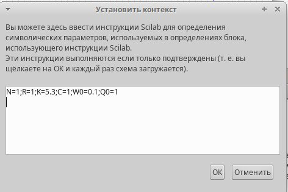
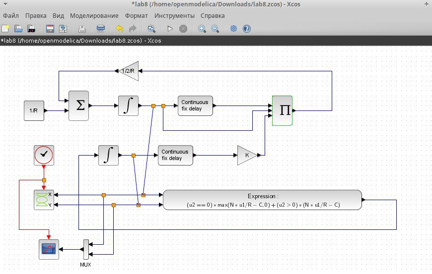
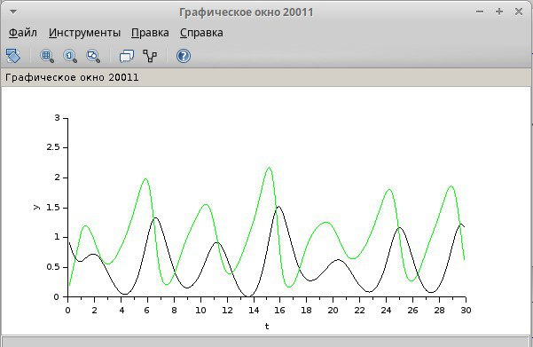
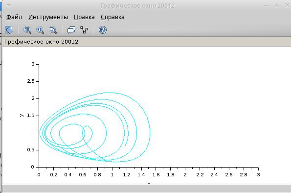
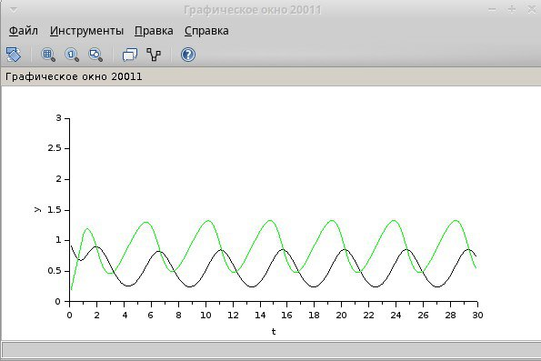
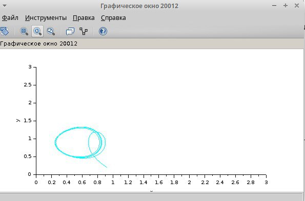
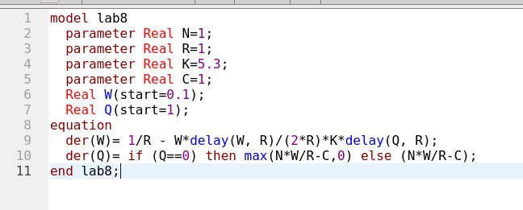
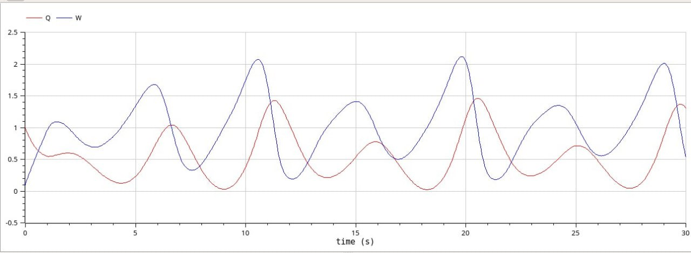
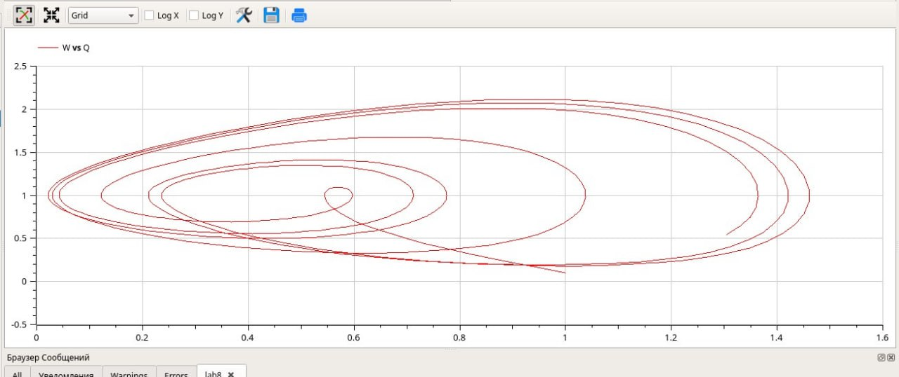

---
## Front matter
lang: ru-RU
title: "Отчет по 8 лабораторной работе"
subtitle: "Дисциплина: Имитационное моделирование"
author:
  - Шошина Е.А.
institute:
  - Группа НФИбд-01-22
  - Российский университет дружбы народов, Москва, Россия
date: 29 марта 2025

## i18n babel
babel-lang: russian
babel-otherlangs: english

## Formatting pdf
toc: false
toc-title: Содержание
slide_level: 2
aspectratio: 169
section-titles: true
theme: metropolis
header-includes:
  - \metroset{progressbar=frametitle,sectionpage=progressbar,numbering=fraction}
  - '\makeatletter'
  - '\beamer@ignorenonframefalse'
  - '\makeatother'
---

# Информация

## Докладчик

:::::::::::::: {.columns align=center}
::: {.column width="70%"}

  * Шошина Евгения Александровна
  * Студентка 3го курса, группа НФИбд-01-22
  * Фундаментальная информатика и информационные технологии
  * Российский университет дружбы народов
  * [Ссылка на репозиторий гитхаба EAShoshina](https://github.com/eashoshina/study_2024-2025_simmod)

:::
::: {.column width="30%"}

:::
::::::::::::::

# Вводная часть

## Цели и задачи

Реализовать модель TCP/AQM в xcos и OpenModelica.

## Задание

1. Построить модель TCP/AQM в xcos;
2. Построить графики динамики изменения размера TCP окна $W(t)$ и размера очереди $Q(t)$;
3. Построить модель TCP/AQM в OpenModelica;

# Теоретическое введение

## Протокол TCP использует механизм динамической регулировки размера окна для предотвращения перегрузок. Уравнение $W(t) = 1/R(t) − (W(t)W(t−R(t)))/(2R(t−R(t)))·p(t−R(t))$ отражает два ключевых режима:  

- **Фаза медленного старта** (первое слагаемое) — линейный рост окна до достижения порога ssthresh;  
- **Фаза избежания перегрузок** (второе слагаемое) — мультипликативное уменьшение окна при детектировании потерь пакетов через функцию p(t).  

## Функция p(t) реализует алгоритм AQM (Active Queue Management), который proactively управляет очередью маршрутизатора для минимизации задержек и потерь.

1. **Постоянные N и R** — позволяют анализировать устойчивость системы методами теории управления.  
2. **Линейная зависимость p(t) от Q(t)** — упрощает анализ влияния длины очереди на динамику окна.  

# Выполнение лабораторной работы

## Задание переменных окружения в xcos для модели

{#fig:001 width=70%}

## Построим модель TCP/AQM в xcos.

{#fig:002 width=70%}

## Построим график динамики изменения размера TCP окна W(t) и размера очереди Q(t). При C=1:

{#fig:003 width=70%}

## Построим фазовый портрет (W,Q).

{#fig:004 width=70%}

## Построим график динамики изменения размера TCP окна W(t) и размера очереди Q(t). При C=0.9:

{#fig:005 width=70%}

## Построим фазовый портрет (W,Q).

{#fig:006 width=70%}

## Реализуем модель с помощью языка Modelica в среде OpenModelica. Для реализации используем оператор delay().

{#fig:007 width=70%}

## Построим график динамики изменения размера TCP окна W(t) и размера очереди Q(t) в среде OpenModelica.

{#fig:008 width=70%}

## Построим фазовый портрет (W,Q) в среде OpenModelica.

{#fig:009 width=70%}

## Выводы

Реализовали модель TCP/AQM в xcos и OpenModelica.

## Список литературы{.unnumbered}

- https://spot.colorado.edu/~lich1539/fn/UtilityMaximization2016.pdf
- https://arxiv.org/pdf/1307.1204
- https://scispace.com/papers/a-two-dimensional-fluid-model-for-tcp-aqm-analysis-1kfrgt1y
