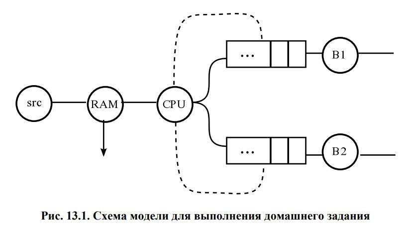
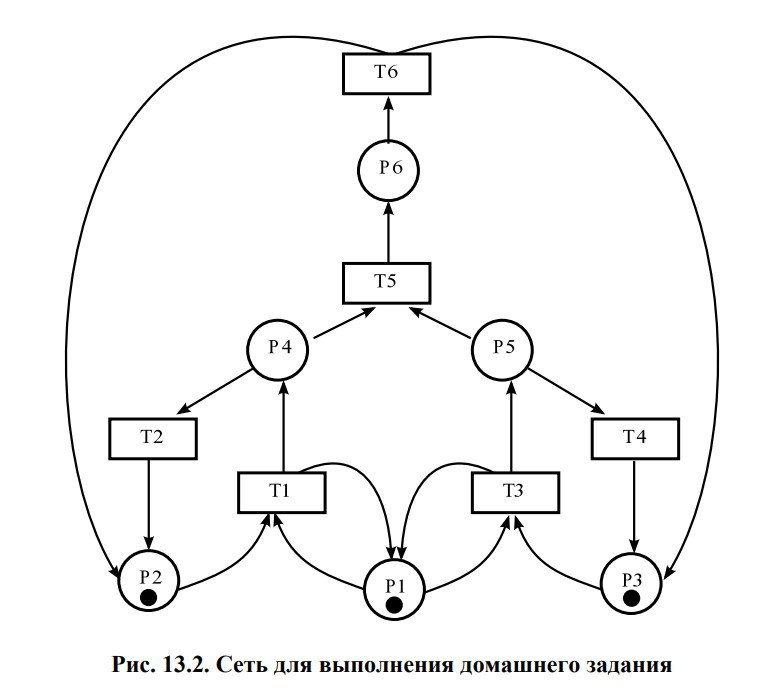
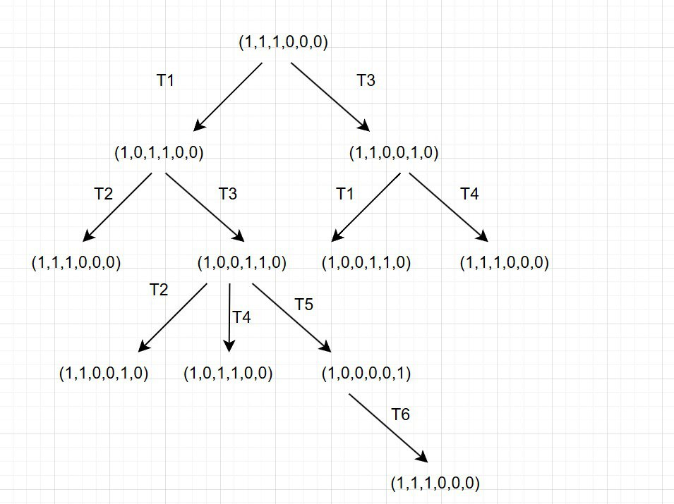
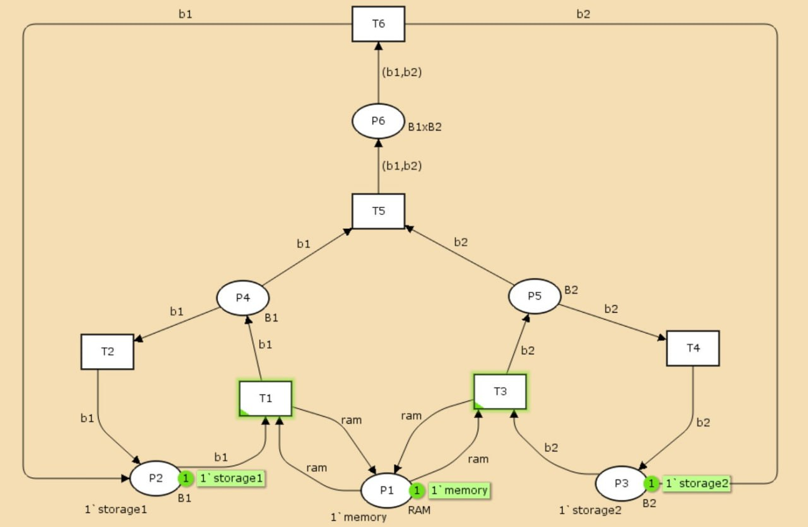
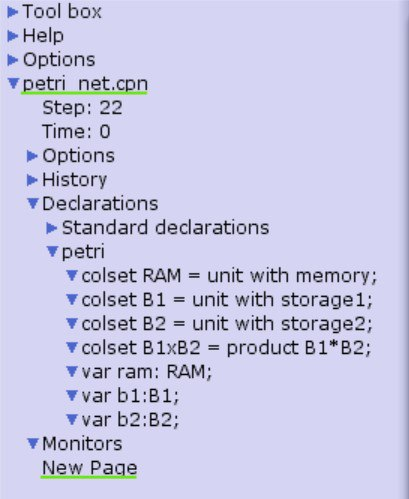
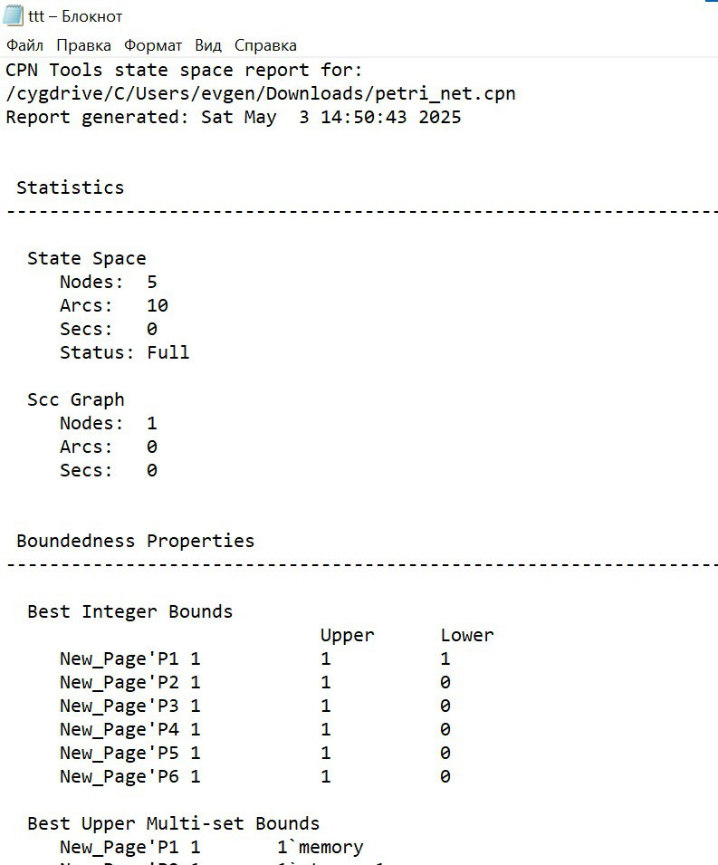
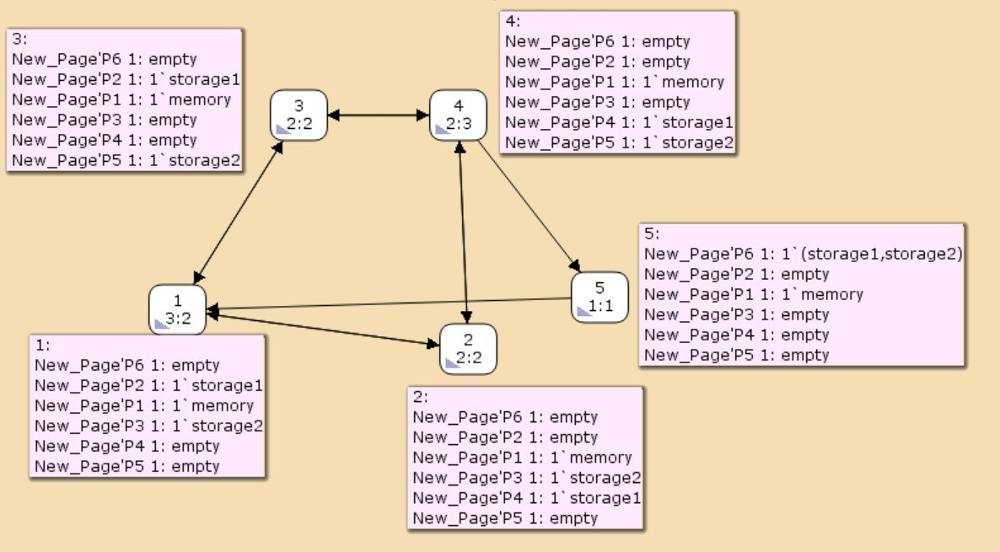

---
## Front matter
lang: ru-RU
title: Лабораторная работа №13
subtitle: Имитационное моделирование
author:
  - Шошина Е.А.
institute:
  - Российский университет дружбы народов, Москва, Россия
  - Объединённый институт ядерных исследований, Дубна, Россия
date: 3 мая 2025

## i18n babel
babel-lang: russian
babel-otherlangs: english

## Formatting pdf
toc: false
toc-title: Содержание
slide_level: 2
aspectratio: 169
section-titles: true
theme: metropolis
header-includes:
 - \metroset{progressbar=frametitle,sectionpage=progressbar,numbering=fraction}
---

# Информация

## Докладчик

:::::::::::::: {.columns align=center}
::: {.column width="70%"}

  * Шошина Евгения Александровна
  * Студентка 3го курса, группа НФИбд-01-22
  * Фундаментальная информатика и информационные технологии
  * Российский университет дружбы народов
  * [Ссылка на репозиторий гитхаба eashoshina](https://github.com/eashoshina/study_2024-2025_simmod)

:::
::: {.column width="30%"}

:::
::::::::::::::

# Теоретическое введение

## Цель работы

Выполнить задание для самостоятельного решения.

## Задание

1. Используя теоретические методы анализа сетей Петри, проведите анализ сети,изображённой на рис. 13.2 (с помощью построения дерева достижимости). Определите, является ли сеть безопасной, ограниченной, сохраняющей, имеются ли тупики.
2. Промоделируйте сеть Петри (см. рис. 13.2) с помощью CPNTools.
3. Вычислите пространство состояний. Сформируйте отчёт о пространстве состояний и проанализируйте его. Постройте граф пространства состояний.

## CPN Tools - это...

- Очень мощный класс сетей Петри для описания моделей. Согласно стандартной классификации такие сети называют иерархическими временными раскрашенными сетями Петри. Было доказано, что они эквивалентны машине Тьюринга и составляет универсальную алгоритмическую систему. Таким образом, произвольный объект может быть описан с помощью этого класса сетей.

## 13.1. Схема модели

- Заявка (команды программы, операнды) поступает в оперативную память (ОП), затем передается на прибор (центральный процессор, ЦП) для обработки. После этого заявка может равновероятно обратиться к оперативной памяти или к одному из двух внешних запоминающих устройств (B1 и B2). Прежде чем записать информацию на внешний накопитель, необходимо вторично обратиться к центральному процессору, определяющему состояние накопителя и выдающему необходимую управляющую информацию. Накопители (B1 и B2) могут работать в 3-х режимах:

1. B1 — занят, B2 — свободен;
2. B2 — свободен, B1 — занят;
3. B1 — занят, B2 — занят.
Схема модели представлена на схеме

## 13.1. Схема модели
{#fig:001 width=70%}

## 13.1. Схема модели
На схеме:
- src — источник заявок;
- B1 и B2 — накопители для хранения заявок;
- RAM — оперативная память;
- CPU — центральный процессор;
- B1, B1 — внешние запоминающие устройства

## 13.2 Описание модели

Сеть Петри моделируемой системы представлена на рис. 13.2.
Множество позиций:
- P1 — состояние оперативной памяти (свободна / занята);
- P2 — состояние внешнего запоминающего устройства B1 (свободно / занято);
- P3 — состояние внешнего запоминающего устройства B2 (свободно / занято);
- P4 — работа на ОП и B1 закончена;
- P5 — работа на ОП и B2 закончена;
- P6 — работа на ОП, B1 и B2 закончена;

## 13.2 Описание модели

{#fig:002 width=50%}

## 13.2 Описание модели
Множество переходов:
- T1 — ЦП работает только с RAM и B1;
- T2 — обрабатываются данные из RAM и с B1 переходят на устройство вывода;
- T3 — CPU работает только с RAM и B2;
- T4 — обрабатываются данные из RAM и с B2 переходят на устройство вывода;
- T5 — CPU работает только с RAM и с B1, B2;
- T6 — обрабатываются данные из RAM, B1, B2 и переходят на устройство вывода.

# Выполнение лабораторной работы

## 1 задание
Построили дерево достижимости и провели анализ сети 

{#fig:003 width=50%}

## 2 задание
Промоделировали сеть Петри с помощью CPNTools.

{#fig:004 width=50%}

## 2 задание

Задали контест в CPNTools.

{#fig:005 width=35%}

## 3 задание

Вычислили пространство состояний. Сформировали отчёт о пространстве состояний и проанализировали его. 

{#fig:006 width=30%}

1. **Общие параметры сети** 

    - Содержит 5 состояний и 10 переходов. Анализ проведён полностью меньше, чем за секунду.

2. **Безопасность**  

    - Все позиции (P1-P6) ограничены одной меткой. P1 всегда хранит метку "memory". P6 временно содержит комбинацию меток (str1, str2).

## 3 задание

3. **Достижимость**

    - Маркировка home для всех состояний, так как в любую позицию мы можем попасть из любой другой маркировки.
    - Маркировка dead равная None, так как нет состояний, из которых переходов быть не может.

4. **Активность переходов** 

    - Все переходы T1-T6 живые (никогда не блокируются).  
    - T5 требует "условной справедливости", T6 - "абсолютной" (особые условия срабатывания).
    
- В конце указано, что бесконечно часто могут происходить переходы T1, T2, T3, T4, но не обязательно, также состояние T5 необходимо для того, чтобы система не попадала в тупик, а состояние T6 происходит всегда, если доступно.

## 3 задание
Построили граф пространства состояний.

{#fig:007 width=50%}

## Выводы

Выполнили задание для самостоятельного решения.

# Список литературы{.unnumbered}

::: 

- https://clck.ru/3Lq3Nx

- https://en.wikipedia.org/wiki/CPN_Tools

- https://community.chocolatey.org/packages/cpntools

::: 
