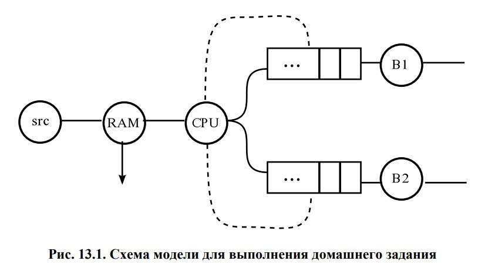
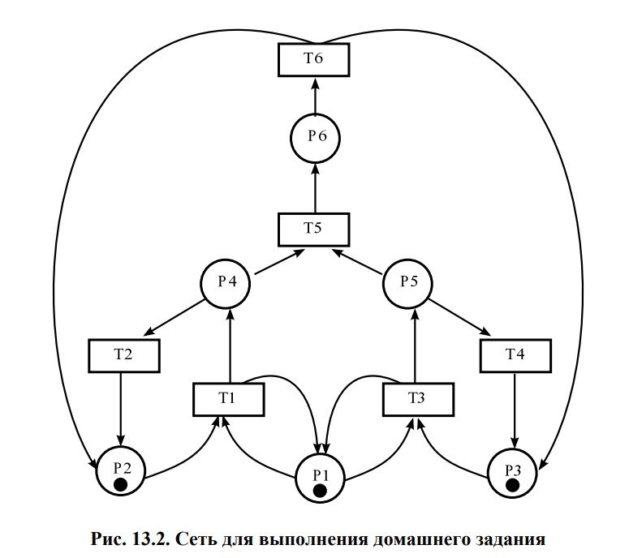
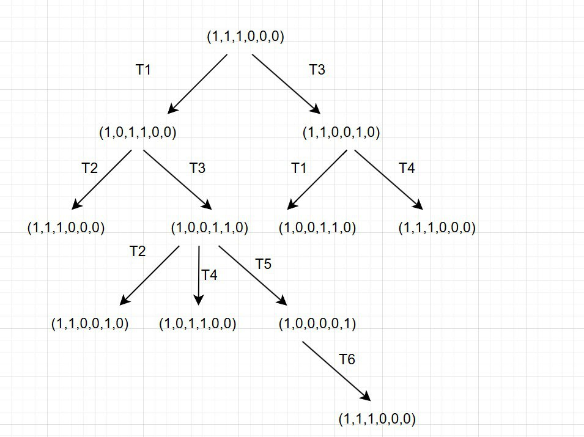
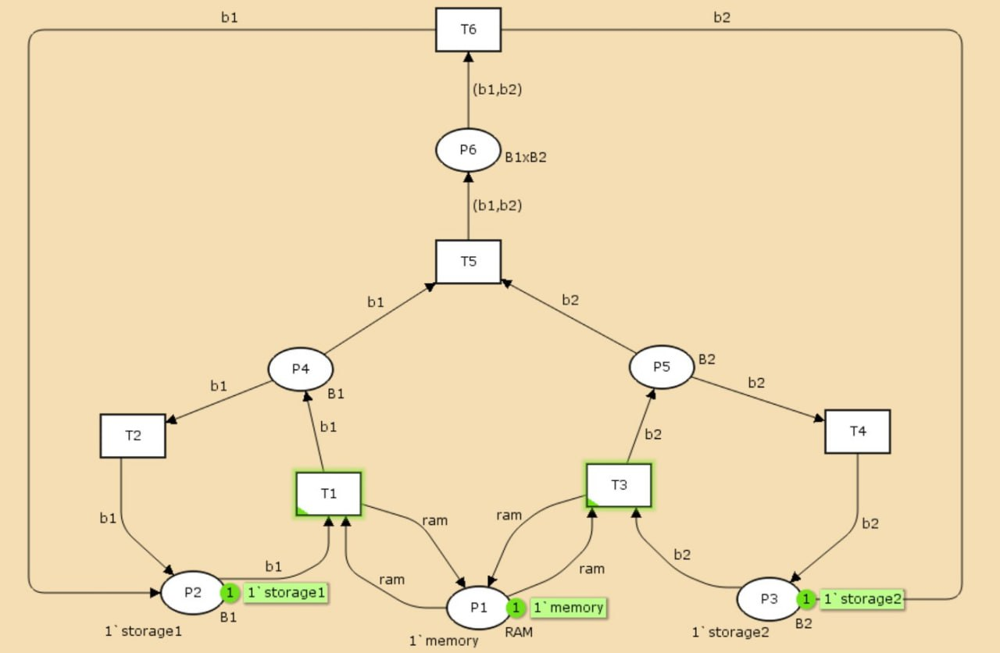
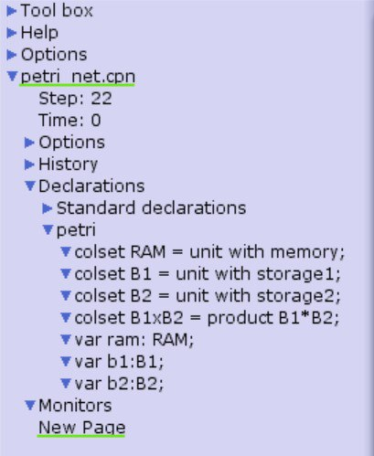
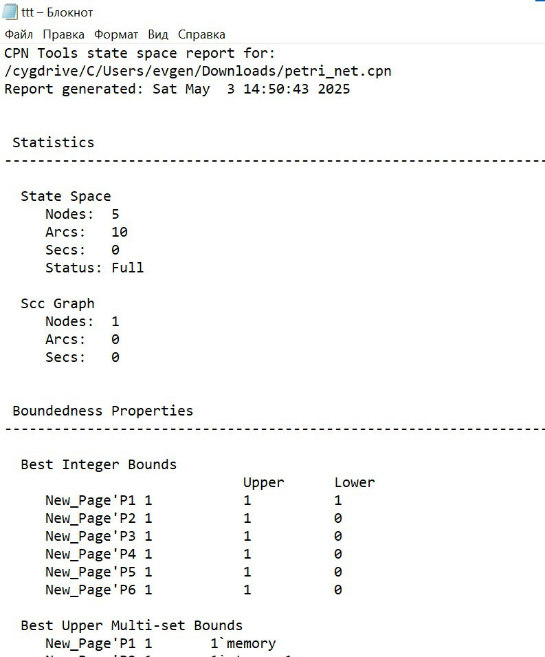
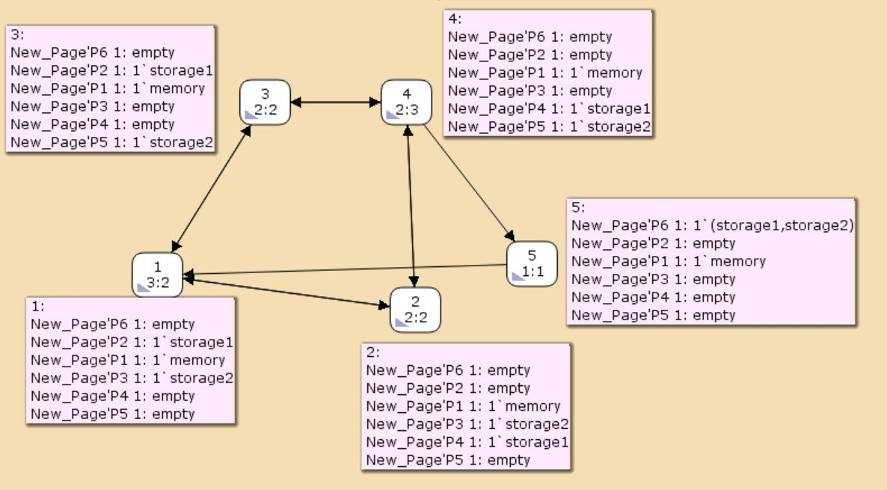

---
## Front matter
title: "Лабораторная работа №13"
subtitle: "Имитационное моделирование"
author: "Шошина Евгения Александровна"

## Generic otions
lang: ru-RU
toc-title: "Содержание"

## Bibliography
bibliography: bib/cite.bib
csl: pandoc/csl/gost-r-7-0-5-2008-numeric.csl

## Pdf output format
toc: true # Table of contents
toc-depth: 2
lof: true # List of figures
lot: true # List of tables
fontsize: 12pt
linestretch: 1.5
papersize: a4
documentclass: scrreprt
## I18n polyglossia
polyglossia-lang:
  name: russian
  options:
	- spelling=modern
	- babelshorthands=true
polyglossia-otherlangs:
  name: english
## I18n babel
babel-lang: russian
babel-otherlangs: english
## Fonts
mainfont: PT Serif
romanfont: PT Serif
sansfont: PT Sans
monofont: PT Mono
mainfontoptions: Ligatures=TeX
romanfontoptions: Ligatures=TeX
sansfontoptions: Ligatures=TeX,Scale=MatchLowercase
monofontoptions: Scale=MatchLowercase,Scale=0.9
## Biblatex
biblatex: true
biblio-style: "gost-numeric"
biblatexoptions:
  - parentracker=true
  - backend=biber
  - hyperref=auto
  - language=auto
  - autolang=other*
  - citestyle=gost-numeric
## Pandoc-crossref LaTeX customization
figureTitle: "Рис."
tableTitle: "Таблица"
listingTitle: "Листинг"
lofTitle: "Список иллюстраций"
lotTitle: "Список таблиц"
lolTitle: "Листинги"
## Misc options
indent: true
header-includes:
  - \usepackage{indentfirst}
  - \usepackage{float} # keep figures where there are in the text
  - \floatplacement{figure}{H} # keep figures where there are in the text
---

# Цель работы

Выполнить задание для самостоятельного решения.

# Задание

1. Используя теоретические методы анализа сетей Петри, проведите анализ сети,изображённой на рис. 13.2 (с помощью построения дерева достижимости). Определите, является ли сеть безопасной, ограниченной, сохраняющей, имеются ли тупики.
2. Промоделируйте сеть Петри (см. рис. 13.2) с помощью CPNTools.
3. Вычислите пространство состояний. Сформируйте отчёт о пространстве состояний и проанализируйте его. Постройте граф пространства состояний.

# Теоретическое введение

CPN Tools – это специальная моделирующая система, которая использует язык сетей Петри для описания моделей. Система была разработана в Университете Орхуса в Дании и свободно распространяется для некоммерческих организаций через сайт http://www.daimi.au.dk/CPNTools/. Уровень предоставляемого сервиса позволяет классифицировать CPN Tools как промышленную моделирующую систему. Она была использована в большом количестве реальных проектов, особенно в области телекоммуникаций. В последнее время корпорация Nokia применяет CPN Tools для управляемой моделью разработки нового поколения мобильных телефонов.

CPN Tools предлагает очень мощный класс сетей Петри для описания моделей. Согласно стандартной классификации такие сети называют иерархическими временными раскрашенными сетями Петри. Было доказано, что они эквивалентны машине Тьюринга и составляет универсальную алгоритмическую систему. Таким образом, произвольный объект может быть описан с помощью этого класса сетей.

13.1. Схема модели
Заявка (команды программы, операнды) поступает в оперативную память (ОП), затем передается на прибор (центральный процессор, ЦП) для обработки. После этого заявка может равновероятно обратиться к оперативной памяти или к одному из двух внешних запоминающих устройств (B1 и B2). Прежде чем записать информацию на внешний накопитель, необходимо вторично обратиться к центральному процессору, определяющему состояние накопителя и выдающему необходимую управляющую информацию. Накопители (B1 и B2) могут работать в 3-х режимах:
1) B1 — занят, B2 — свободен;
2) B2 — свободен, B1 — занят;
3) B1 — занят, B2 — занят.
Схема модели представлена на (рис. @fig:001)

{#fig:001 width=70%}

На схеме:
– src — источник заявок;
– B1 и B2 — накопители для хранения заявок;
– RAM — оперативная память;
– CPU — центральный процессор;
– B1, B1 — внешние запоминающие устройства

13.2 Описание модели (рис. @fig:002)
Сеть Петри моделируемой системы представлена на рис. 13.2.
Множество позиций:
P1 — состояние оперативной памяти (свободна / занята);
P2 — состояние внешнего запоминающего устройства B1 (свободно / занято);
P3 — состояние внешнего запоминающего устройства B2 (свободно / занято);
P4 — работа на ОП и B1 закончена;
P5 — работа на ОП и B2 закончена;
P6 — работа на ОП, B1 и B2 закончена;

{#fig:002 width=70%}

Множество переходов:
T1 — ЦП работает только с RAM и B1;
T2 — обрабатываются данные из RAM и с B1 переходят на устройство вывода;
T3 — CPU работает только с RAM и B2;
T4 — обрабатываются данные из RAM и с B2 переходят на устройство вывода;
T5 — CPU работает только с RAM и с B1, B2;
T6 — обрабатываются данные из RAM, B1, B2 и переходят на устройство вывода.

Функционирование сети Петри можно расматривать как срабатывание переходов, в ходе которого происходит перемещение маркеров по позициям:
– работа CPU с RAM и B1 отображается запуском перехода T1 (удаление маркеров из P1, P2 и появление в P1, P4), что влечет за собой срабатывание перехода T2, т.е. передачу данных с RAM и B1 на устройство вывода;
– работа CPU с RAM и B2 отображается запуском перехода T3 (удаление маркеров из P1 и P3 и появление в P1 и P5), что влечет за собой срабатывание перехода T4, т.е. передачу данных с RAM и B2 на устройство вывода;
– работа CPU с RAM, B1 и B2 отображается запуском перехода T5 (удаление маркеров из P4 и P5 и появление в P6), далее срабатывание перехода T6, и данные из RAM, B1 и B2 передаются на устройство вывода;
– состояние устройств восстанавливается при срабатывании: RAM — переходов T1 или T2; B1 — переходов T2 или T6; B2 — переходов T4 или T6.

# Выполнение лабораторной работы
### 1 задание
Построили дерево достижимости и провели анализ сети (рис. @fig:003).

{#fig:003 width=70%}

### 2 задание
Промоделировали сеть Петри с помощью CPNTools.(рис. @fig:004)

{#fig:004 width=70%}

Задали контест в CPNTools.(рис. @fig:005)

{#fig:005 width=70%}

### 3 задание

Вычислили пространство состояний. Сформировали отчёт о пространстве состояний и проанализировали его. (рис. @fig:006)

{#fig:006 width=70%}

Из отчета можно увидеть:

1. **Общие параметры сети** 

    - Содержит 5 состояний и 10 переходов. Анализ проведён полностью меньше, чем за секунду.

2. **Безопасность**  

    - Все позиции (P1-P6) ограничены одной меткой. P1 всегда хранит метку "memory". P6 временно содержит комбинацию меток (str1, str2).

3. **Достижимость**

    - Маркировка home для всех состояний, так как в любую позицию мы можем попасть из любой другой маркировки.
    - Маркировка dead равная None, так как нет состояний, из которых переходов быть не может.

4. **Активность переходов** 

    - Все переходы T1-T6 живые (никогда не блокируются).  
    - T5 требует "условной справедливости", T6 - "абсолютной" (особые условия срабатывания).
    
В конце указано, что бесконечно часто могут происходить переходы T1, T2, T3, T4, но не обязательно, также состояние T5 необходимо для того, чтобы система не попадала в тупик, а состояние T6 происходит всегда, если доступно.

Построили граф пространства состояний.(рис. @fig:007)

{#fig:007 width=70%}

# Выводы

Выполнили задание для самостоятельного решения.

# Список литературы{.unnumbered}

::: 
- https://docs.yandex.ru/docs/view?tm=1746275639&tld=ru&lang=ru&name=cpnmp-ru.pdf&text=cpn%20tools%20%D1%8D%D1%82%D0%BE%20%D1%87%D1%82%D0%BE&url=http%3A%2F%2Fdaze.ho.ua%2Fcpnmp-ru.pdf&lr=213&mime=pdf&l10n=ru&sign=a6a9325b2613af43bd90ae2a598df5f3&keyno=0&nosw=1&serpParams=tm%3D1746275639%26tld%3Dru%26lang%3Dru%26name%3Dcpnmp-ru.pdf%26text%3Dcpn%2Btools%2B%25D1%258D%25D1%2582%25D0%25BE%2B%25D1%2587%25D1%2582%25D0%25BE%26url%3Dhttp%253A%2F%2Fdaze.ho.ua%2Fcpnmp-ru.pdf%26lr%3D213%26mime%3Dpdf%26l10n%3Dru%26sign%3Da6a9325b2613af43bd90ae2a598df5f3%26keyno%3D0%26nosw%3D1

- https://en.wikipedia.org/wiki/CPN_Tools

- https://community.chocolatey.org/packages/cpntools
:::
