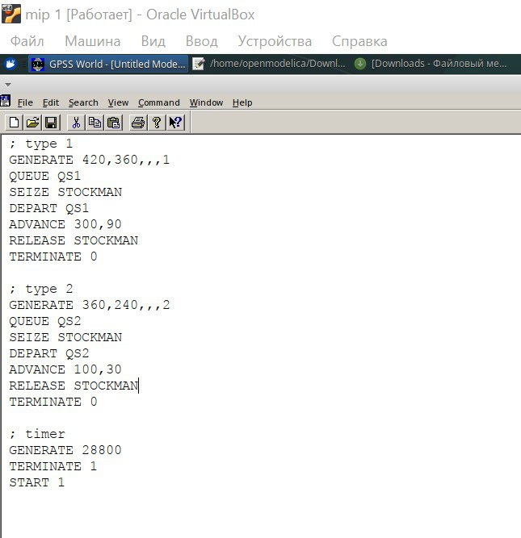
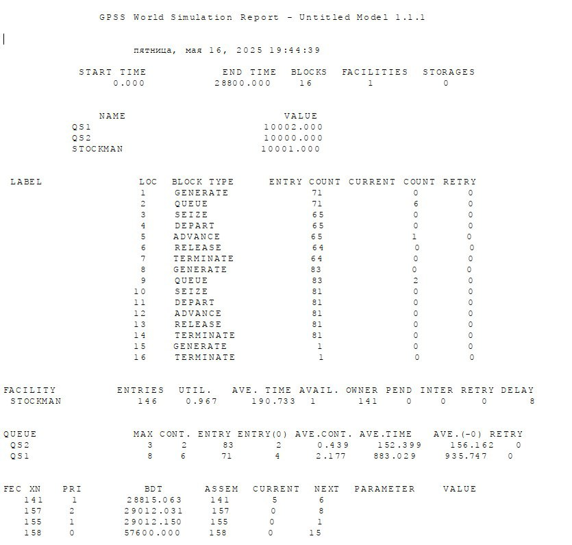
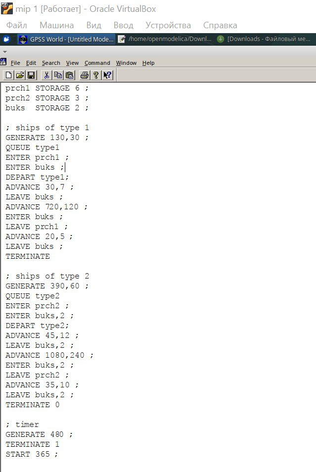
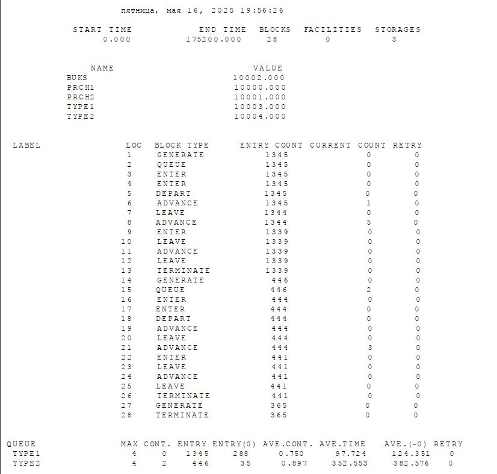
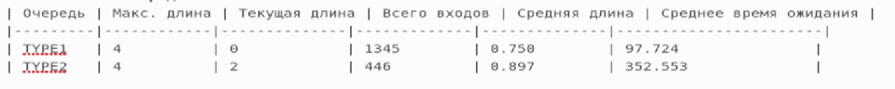

---
## Front matter
lang: ru-RU
title: Лабораторная работа №15
subtitle: Имитационное моделирование
author:
  - Шошина Е.А.
institute:
  - Российский университет дружбы народов, Москва, Россия
  - Объединённый институт ядерных исследований, Дубна, Россия
date: 3 мая 2025

## i18n babel
babel-lang: russian
babel-otherlangs: english

## Formatting pdf
toc: false
toc-title: Содержание
slide_level: 2
aspectratio: 169
section-titles: true
theme: metropolis
header-includes:
 - \metroset{progressbar=frametitle,sectionpage=progressbar,numbering=fraction}
---

# Информация

## Докладчик

:::::::::::::: {.columns align=center}
::: {.column width="70%"}

  * Шошина Евгения Александровна
  * Студентка 3го курса, группа НФИбд-01-22
  * Фундаментальная информатика и информационные технологии
  * Российский университет дружбы народов
  * [Ссылка на репозиторий гитхаба eashoshina](https://github.com/eashoshina/study_2024-2025_simmod)

:::
::: {.column width="30%"}

:::
::::::::::::::

## Цель работы

Построить модели обслуживания с приоритетами.

## Задание

1. Построить модели обслуживания механиков на складе.
2. Построить модели обслуживания в порту судов двух типов.
3. Проанализировать полученные отчеты.

# Теоретическое введение
## Модель обслуживания механиков на складе
На фабрике на складе работает один кладовщик, который выдает запасные части механикам, обслуживающим станки. Время, необходимое для удовлетворения запроса, зависит от типа запасной части.

- Для первой категории интервалы времени прихода механиков 420 ± 360 сек., время обслуживания — 300 ± 90 сек. 
- Для второй категории интервалы времени прихода механиков 360 ± 240 сек., время обслуживания — 100 ± 30 сек.
- Порядок обслуживания механиков кладовщиком такой: запросы первой категории обслуживаются только в том случае, когда в очереди нет ни одного запроса второй категории. Внутри одной категории дисциплина обслуживания — «первым пришел – первым обслужился». 

## Построение модели
Есть два различных типа заявок, поступающих на обслуживание к одному устройству. Различаются распределения интервалов приходов и времени обслуживания для этих типов заявок. Приоритеты запросов задаются путем использования для операнда E блока GENERATE запросов второй категории большего значения, чем для запросов первой категории.

## Модель обслуживания в порту судов двух типов
Морские суда двух типов прибывают в порт, где происходит их разгрузка. В порту есть два буксира, обеспечивающих ввод и вывод кораблей из порта. 
- К первому типу судов относятся корабли малого тоннажа, которые требуют использования одного буксира. 
- Корабли второго типа имеют большие размеры, и для их ввода и вывода из порта требуется два буксира. И
- Корабли имеют различное время погрузки/разгрузки. 
- Корабль, ожидающий освобождения причала, не обслуживается буксиром до тех пор, пока не будет предоставлен нужный причал. Корабль второго типа не займёт буксир до тех пор, пока ему не будут доступны оба буксира.

## Параметры модели
- для корабля первого типа:
- интервал прибытия: 130 ± 30 мин;
- время входа в порт: 30 ± 7 мин;
- количество доступных причалов: 6;
- время погрузки/разгрузки: 12 ± 2 час;
- время выхода из порта: 20 ± 5 мин;

## Параметры модели
- для корабля второго типа:
- интервал прибытия: 390 ± 60 мин;
- время входа в порт: 45 ± 12 мин;
- количество доступных причалов: 3;
- время погрузки/разгрузки: 18 ± 4 час;
- время выхода из порта: 35 ± 10 мин.
- время моделирования: 365 дней по 8 часов.

# Выполнение лабораторной работы
## Создали модель обслуживания механиков на складе

{#fig:001 width=40%}

## Получили отчет для модели №1
{#fig:002 width=40%}

## Создали модель обслуживания в порту судов двух типов
{#fig:003 width=40%}

## Получили отчет для модели №2

{#fig:004 width=40%}

## Задание

Отчет показывает результаты имитационного моделирования работы системы с двумя типами транзактов (процессов), конкурирующих за общий ресурс (STOCKMAN).

## Модель обслуживания механиков на складе
Модель имитирует систему с **одним разделяемым ресурсом (STOCKMAN)**, который обрабатывает два типа транзактов:  
- **Тип 1** – более редкие, но долгие операции (время обработки: `300±90` ед. времени).  
- **Тип 2** – более частые, но короткие операции (`100±30` ед. времени).  
Оба типа используют **разные очереди (QS1 и QS2)**, но конкурируют за один ресурс.  

## Модель обслуживания механиков на складе
- **Утилизация: 96.7%** → ресурс работает почти на пределе.  
- **Среднее время занятия: ~191 ед. времени** → подтверждает, что транзакты "висят" в системе долго.  
- **Очереди накапливаются**:  
  - В QS1 – до **8 транзактов** (среднее содержание: **2.17**).  
  - В QS2 – до **3 транзактов** (среднее содержание: **0.44**).  
  
## Модель обслуживания механиков на складе  
- **Тип 1 (QS1):**  
Среднее время ожидания – **883 ед.** (почти в **6 раз дольше**, чем у типа 2!).  
Это логично: они долго обрабатываются, поэтому новые транзакты ждут в очереди.  
- **Тип 2 (QS2):**  
Среднее время ожидания – **152 ед.**  
Несмотря на меньшую задержку, очередь тоже простаивает (до **2 транзактов**).  

## Модель обслуживания механиков на складе
- **Тип 1:** 71 вход в систему (из них **6** всё ещё в очереди).  
- **Тип 2:** 83 входа (из них **2** в очереди).  
- **Ресурс STOCKMAN** использовался **146 раз** (суммарно для обоих типов).  

## Модель обслуживания в порту судов двух типов
**Ресурсы:**
- **prch1** (причал 1) - ёмкость 6 единиц
- **prch2** (причал 2) - ёмкость 3 единицы
- **buks** (буксиры) - ёмкость 2 единицы

## Модель обслуживания в порту судов двух типов
1. **Тип 1**:
   - Генерируются каждые 130±30 единиц времени
   - Используют причал prch1 и 1 буксир
   - Время обработки: 30±7 и 720±120 единиц времени

2. **Тип 2**:
   - Генерируются каждые 390±60 единиц времени
   - Используют причал prch2 и 2 буксира
   - Время обработки: 45±12 и 1080±240 единиц времени
   
## Модель обслуживания в порту судов двух типов  
- Время симуляции: 175200 единиц времени
- Всего блоков в модели: 28
- Storage (хранилища/ресурсы): 3 (prch1, prch2, buks)

**Обработанные транзакты:**
- **Тип 1**: 1345 входов (все обработаны, 0 в очереди)
- **Тип 2**: 446 входов (2 в очереди)

## Модель обслуживания в порту судов двух типов  
**Статистика очередей:**
{#fig:005 width=70%}

## Выводы

Построили модели обслуживания с приоритетами.

## Список литературы{.unnumbered}
1. Амурский государственный университет. Моделирование систем массового обслуживания в среде GPSS World. — 2013. — 24 с. — URL: \url{https://irbis.amursu.ru/DigitalLibrary/AmurSU_Edition/010.pdf}.  
2. Хабр. Полезные возможности Bash, о которых вы могли не знать. — 2013. — URL: \url{https://habr.com/ru/articles/192044/}.  
3. Иванов И. И., Петров П. П., Сидоров С. С. Создание моделей систем обслуживания в среде GPSS World // Научный вестник. — 2014. — С. 45–52. — URL: \url{https://www.researchgate.net/publication/278037992_Sozdanie_modelej_sistem_obsluzivania_v_srede_GPSS_World}.  

