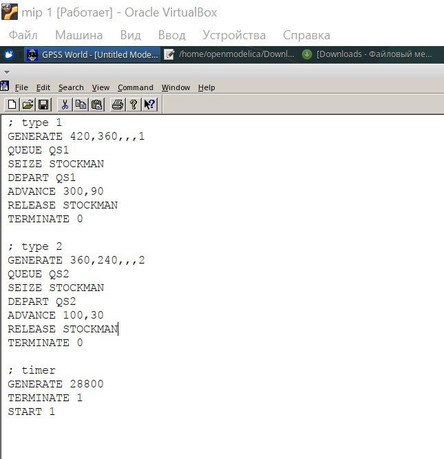
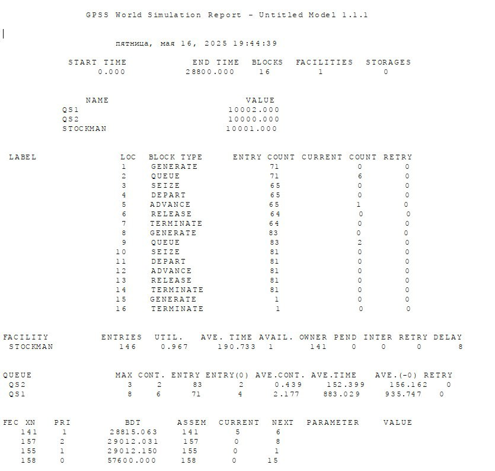
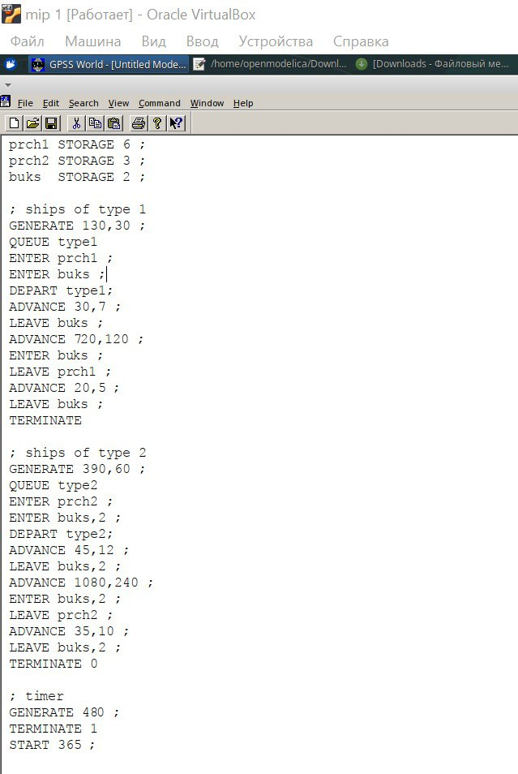
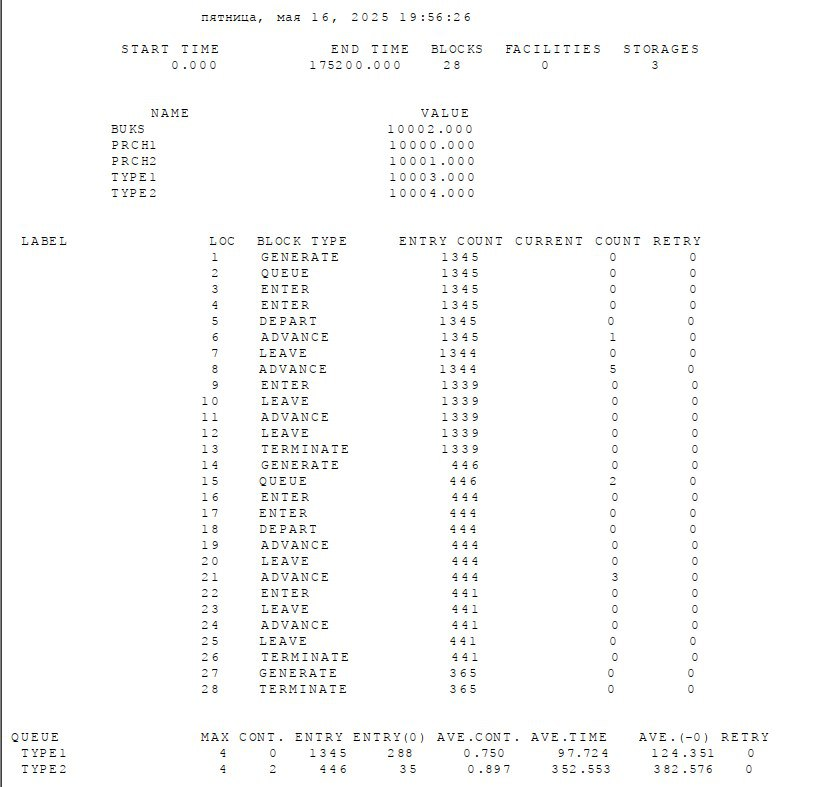

---
## Front matter
title: "Лабораторная работа №15"
subtitle: "Имитационное моделирование"
author: "Шошина Евгения Александровна"

## Generic options
lang: ru-RU
toc-title: "Содержание"

## Bibliography
bibliography: bib/cite.bib
csl: pandoc/csl/gost-r-7-0-5-2008-numeric.csl

## Pdf output format
toc: true
lof: true
lot: true
fontsize: 12pt
linestretch: 1.5
papersize: a4
documentclass: scrreprt

## Fonts
mainfont: "Times New Roman"
romanfont: "Times New Roman"
sansfont: "Arial"
monofont: "Courier New"

header-includes:
  - \usepackage{indentfirst}
  - \usepackage{float}
  - \floatplacement{figure}{H}
  - \usepackage{amsmath}
  - \DeclareUnicodeCharacter{2192}{\ensuremath{\rightarrow}}
---
## Biblatex
biblatex: true
biblio-style: "gost-numeric"
biblatexoptions:
  - parentracker=true
  - backend=biber
  - hyperref=auto
  - language=auto
  - autolang=other*
  - citestyle=gost-numeric
## Pandoc-crossref LaTeX customization
figureTitle: "Рис."
tableTitle: "Таблица"
listingTitle: "Листинг"
lofTitle: "Список иллюстраций"
lotTitle: "Список таблиц"
lolTitle: "Листинги"
## Misc options
indent: true
header-includes:
  - \usepackage{indentfirst}
  - \usepackage{float} # keep figures where there are in the text
  - \floatplacement{figure}{H} # keep figures where there are in the text
---

# Цель работы

Построить модели обслуживания с приоритетами.
# Задание

1. Построить модели обслуживания механиков на складе.
2. Построить модели обслуживания в порту судов двух типов.
3. Проанализировать полученные отчеты

# Теоретическое введение
### 15.1. Модель обслуживания механиков на складе
### 15.1.1. Постановка задачи
На фабрике на складе работает один кладовщик, который выдает запасные части механикам, обслуживающим станки. Время, необходимое для удовлетворения запроса, зависит от типа запасной части. Запросы бывают двух категорий. Для первой категории интервалы времени прихода механиков 420 ± 360 сек., время обслуживания — 300 ± 90 сек. Для второй категории интервалы времени прихода механиков 360 ± 240 сек., время обслуживания — 100 ± 30 сек Порядок обслуживания механиков кладовщиком такой: запросы первой категории обслуживаются только в том случае, когда в очереди нет ни одного запроса второй категории. Внутри одной категории дисциплина обслуживания — «первым пришел – первым обслужился». Необходимо создать модель работы кладовой, моделирование выполнять в течение восьмичасового рабочего дня.

### 15.1.2.Построение модели
Есть два различных типа заявок, поступающих на обслуживание к одному устройству. Различаются распределения интервалов приходов и времени обслуживания для этих типов заявок. Приоритеты запросов задаются путем использования для операнда E блока GENERATE запросов второй категории большего значения, чем для запросов первой категории. Модель можно представить следующим образом:

Модель можно представить следующим образом:
```; type 1
GENERATE 420,360,,,1
QUEQUE qs1
SEIZE stockman
DEPART qs1
ADVANCE 300,90
RELEASE stockman
TERMINATE 0
; type 2
GENERATE 360,240,,,2
QUEQUE qs2
SEIZE stockman
DEPART qs2
ADVANCE 100,30
RELEASE stockman
TERMINATE 0
Сегмент моделирования таймера:
;timer
GENERATE 28800
TERMINATE 1
START 1
```

### 15.2. Модель обслуживания в порту судов двух типов
###15.2.1. Постановка задачи
Морские суда двух типов прибывают в порт, где происходит их разгрузка. В порту есть два буксира, обеспечивающих ввод и вывод кораблей из порта. К первому типу судов относятся корабли малого тоннажа, которые требуют использования одного буксира. Корабли второго типа имеют большие размеры, и для их ввода и вывода из порта требуется два буксира. Из-за различия размеров двух типов кораблей необходимы и причалы различного размера. Кроме того, корабли имеют различное время погрузки/разгрузки. Требуется построить модель системы, в которой можно оценить время ожидания кораблями каждого типа входа в порт. Время ожидания входа в порт включает время ожидания освобождения причала и буксира. Корабль, ожидающий освобождения причала, не обслуживается буксиром до тех пор, пока не будет предоставлен нужный причал. Корабль второго типа не займёт буксир до тех пор, пока ему не будут доступны оба буксира.

##### Параметры модели:
- для корабля первого типа:
- интервал прибытия: 130 ± 30 мин;
- время входа в порт: 30 ± 7 мин;
- количество доступных причалов: 6;
- время погрузки/разгрузки: 12 ± 2 час;
- время выхода из порта: 20 ± 5 мин;
- для корабля второго типа:
- интервал прибытия: 390 ± 60 мин;
- время входа в порт: 45 ± 12 мин;
- количество доступных причалов: 3;
- время погрузки/разгрузки: 18 ± 4 час;
- время выхода из порта: 35 ± 10 мин.
- время моделирования: 365 дней по 8 часов.

### 15.2.2. Построение модели

```prch1 STORAGE 6 ; 6 причалов для кораблей 1 типа
prch2 STORAGE 3 ; 3 причала для кораблей 2 типа
buks STORAGE 2 ; 2 буксира
; ships of type 1
GENERATE 130,30 ; подход к порту
QUEUE type1
ENTER prch1 ; получение причала
ENTER buks ; получение буксира
DEPART type1 ;
ADVANCE 30,7 ; буксирование до причала
LEAVE buks ; освобождение буксира
ADVANCE 720,120 ; погрузка / разгрузка
ENTER buks ; получение буксира
LEAVE prch1 ; освобождение причала
ADVANCE 20,5 ; буксирование (отчаливание)
LEAVE buks ; освобождение буксира
TERMINATE
; ships of type 2
GENERATE 390,60 ; подход к порту
QUEUE type2
ENTER prch2 ; получение причала
ENTER buks,2 ; получение 2-х буксиров
DEPART type2 ;
ADVANCE 45,12 ; буксирование до причала
LEAVE buks,2 ; освобождение буксиров
ADVANCE 1080,240; погрузка / разгрузка
ENTER buks,2 ; получение 2-х буксиров
LEAVE prch2 ; освобождение причала
ADVANCE 35,10 ; буксирование (отчаливание)
LEAVE buks,2 ; освобождение буксира
TERMINATE 0
Сегмент моделирования таймера:
; timer
GENERATE 480 ; 8 часов рабочего дня
TERMINATE 1
START 365 ; число дней моделирования

```
# Выполнение лабораторной работы

Создали модель обслуживания механиков на складе (рис. [-@fig:001]).

{#fig:001 width=70%}

Получили отчет для модели №1(рис. [-@fig:002]).

{#fig:002 width=70%}

Создали модель обслуживания в порту судов двух типов(рис. [-@fig:003]).

{#fig:003 width=70%}

Получили отчет для модели №2

{#fig:001 width=70%}

### Задание

Отчет показывает результаты имитационного моделирования работы системы с двумя типами транзактов (процессов), конкурирующих за общий ресурс (STOCKMAN).

## Основные параметры модели

1. **Тип 1 транзактов**:
   - Генерируются каждые 420±360 единиц времени
   - Ожидают в очереди QS1
   - Занимают ресурс STOCKMAN
   - Выполняются 300±90 единиц времени
   - Освобождают ресурс

2. **Тип 2 транзактов**:
   - Генерируются каждые 360±240 единиц времени
   - Ожидают в очереди QS2
   - Занимают ресурс STOCKMAN
   - Выполняются 100±30 единиц времени
   - Освобождают ресурс

3. **Таймер**:
   - Останавливает симуляцию через 28800 единиц времени (8 часов при переводе в секунды)

### **1. Общее описание модели**  
Модель имитирует систему с **одним разделяемым ресурсом (STOCKMAN)**, который обрабатывает два типа транзактов:  
- **Тип 1** – более редкие, но долгие операции (время обработки: `300±90` ед. времени).  
- **Тип 2** – более частые, но короткие операции (`100±30` ед. времени).  

Оба типа используют **разные очереди (QS1 и QS2)**, но конкурируют за один ресурс.  

---

### **2. Ключевые метрики из отчёта**  

#### **2.1. Загрузка ресурса (STOCKMAN)**  
- **Утилизация: 96.7%** → ресурс работает почти на пределе.  
- **Среднее время занятия: ~191 ед. времени** → подтверждает, что транзакты "висят" в системе долго.  
- **Очереди накапливаются**:  
  - В QS1 – до **8 транзактов** (среднее содержание: **2.17**).  
  - В QS2 – до **3 транзактов** (среднее содержание: **0.44**).  

#### **2.2. Время ожидания**  
- **Тип 1 (QS1):**  
  - Среднее время ожидания – **883 ед.** (почти в **6 раз дольше**, чем у типа 2!).  
  - Это логично: они долго обрабатываются, поэтому новые транзакты ждут в очереди.  
- **Тип 2 (QS2):**  
  - Среднее время ожидания – **152 ед.**  
  - Несмотря на меньшую задержку, очередь тоже простаивает (до **2 транзактов**).  

#### **2.3. Количество обработанных транзактов**  
- **Тип 1:** 71 вход в систему (из них **6** всё ещё в очереди).  
- **Тип 2:** 83 входа (из них **2** в очереди).  
- **Ресурс STOCKMAN** использовался **146 раз** (суммарно для обоих типов).  

---

### **3. Проблемы системы**  
1. **Ресурс STOCKMAN – "узкое место"** (96.7% загрузки).  
2. **Тип 1 транзактов страдает сильнее**:  
   - Долгое время обработки → очередь растёт быстрее.  
   - Среднее время ожидания почти **в 6 раз выше**, чем у типа 2.  
3. **Дисбаланс в обслуживании**:  
   - Короткие транзакты (тип 2) могли бы обрабатываться быстрее, но их задерживают долгие операции типа 1.  

---

### **4. Возможные улучшения**  
#### **4.1. Увеличение числа ресурсов**  
- Добавить **ещё одного "кладовщика" (STOCKMAN2)** – это снизит очередь и ускорит обработку.  

#### **4.2. Приоритезация транзактов**  
- Дать **приоритет типу 2** (короткие транзакты), чтобы они не ждали долгих операций.  

#### **4.3. Оптимизация времени обработки**  
- Уменьшить разброс времени для типа 1 (`300±90` → `300±30`), чтобы снизить пиковые нагрузки.  

#### **4.4. Балансировка очередей**  
- Ввести **единую очередь** с динамическим распределением (например, по принципу SJF – Shortest Job First).  


# Анализ отчёта имитационного моделирования системы обработки судов (кораблей)

## Общее описание модели
Модель имитирует систему обработки двух типов судов, использующих общие ресурсы причалов и буксиров. Основные компоненты:

### Ресурсы системы:
- **prch1** (причал 1) - ёмкость 6 единиц
- **prch2** (причал 2) - ёмкость 3 единицы
- **buks** (буксиры) - ёмкость 2 единицы

### Типы судов:
1. **Тип 1**:
   - Генерируются каждые 130±30 единиц времени
   - Используют причал prch1 и 1 буксир
   - Время обработки: 30±7 и 720±120 единиц времени

2. **Тип 2**:
   - Генерируются каждые 390±60 единиц времени
   - Используют причал prch2 и 2 буксира
   - Время обработки: 45±12 и 1080±240 единиц времени

## Ключевые метрики из отчёта

### Общая статистика:
- Время симуляции: 175200 единиц времени
- Всего блоков в модели: 28
- Storage (хранилища/ресурсы): 3 (prch1, prch2, buks)

### Обработанные транзакты:
- **Тип 1**: 1345 входов (все обработаны, 0 в очереди)
- **Тип 2**: 446 входов (2 в очереди)

### Статистика очередей:
| Очередь | Макс. длина | Текущая длина | Всего входов | Средняя длина | Среднее время ожидания |
|---------|------------|--------------|-------------|--------------|-----------------------|
| TYPE1   | 4          | 0            | 1345        | 0.750        | 97.724               |
| TYPE2   | 4          | 2            | 446         | 0.897        | 352.553              |

## Анализ проблем системы

1. **Буксиры (buks) как узкое место**:
   - Суда типа 2 требуют сразу 2 буксира (из 2 доступных), что создаёт конкуренцию
   - Это объясняет более высокое время ожидания для типа 2 (352.553 vs 97.724)

2. **Дисбаланс в обслуживании**:
   - Суда типа 1 обрабатываются в 3 раза чаще (1345 vs 446)
   - Но суда типа 2 ждут в 3.6 раза дольше

3. **Ограниченная ёмкость причалов**:
   - prch2 имеет меньшую ёмкость (3 vs 6 у prch1), что дополнительно ограничивает тип 2

## Рекомендации по улучшению

1. **Увеличение количества буксиров**:
   - Добавить хотя бы 1 дополнительный буксир (с 2 до 3)
   - Это снизит конкуренцию, особенно для типа 2

2. **Оптимизация использования ресурсов**:
   - Перераспределить буксиры между типами судов
   - Возможно выделить 1 буксир исключительно для типа 1

3. **Балансировка очередей**:
   - Ввести приоритетное обслуживание для типа 2 из-за большего времени ожидания
   - Или реализовать систему динамического распределения буксиров

4. **Увеличение ёмкости prch2**:
   - Если возможно, увеличить количество мест на втором причале с 3 до 4-5

## Вывод

Система демонстрирует хорошую пропускную способность для судов типа 1, но испытывает трудности с обработкой типа 2 из-за:
1) ограниченного количества буксиров
2) меньшей ёмкости prch2
3) большей ресурсоёмкости операций типа 2

Оптимизация системы должна быть направлена в первую очередь на увеличение количества буксиров и пересмотр политики их распределения между типами судов.

# Выводы

Построили модели обслуживания с приоритетами.

# Список литературы{.unnumbered}
1. Амурский государственный университет. Моделирование систем массового обслуживания в среде GPSS World. — 2013. — 24 с. — URL: \url{https://irbis.amursu.ru/DigitalLibrary/AmurSU_Edition/010.pdf}.  
2. Хабр. Полезные возможности Bash, о которых вы могли не знать. — 2013. — URL: \url{https://habr.com/ru/articles/192044/}.  
3. Иванов И. И., Петров П. П., Сидоров С. С. Создание моделей систем обслуживания в среде GPSS World // Научный вестник. — 2014. — С. 45–52. — URL: \url{https://www.researchgate.net/publication/278037992_Sozdanie_modelej_sistem_obsluzivania_v_srede_GPSS_World}.  

:::
