---
## Front matter
lang: ru-RU
title: "Отчет по 16 лабораторной работе"
subtitle: "Дисциплина: Имитационное моделирование"
author:
  - Шошина Е.А.
institute:
  - Группа НФИбд-01-22
  - Российский университет дружбы народов, Москва, Россия
date: 24 мая 2025

## i18n babel
babel-lang: russian
babel-otherlangs: english

## Formatting pdf
toc: false
toc-title: Содержание
slide_level: 2
aspectratio: 169
section-titles: true
theme: metropolis
header-includes:
  - \metroset{progressbar=frametitle,sectionpage=progressbar,numbering=fraction}
  - '\makeatletter'
  - '\beamer@ignorenonframefalse'
  - '\makeatother'
---

# Информация

## Докладчик

:::::::::::::: {.columns align=center}
::: {.column width="70%"}

  * Шошина Евгения Александровна
  * Студентка 3го курса, группа НФИбд-01-22
  * Фундаментальная информатика и информационные технологии
  * Российский университет дружбы народов
  * [Ссылка на репозиторий гитхаба EAShoshina](https://github.com/eashoshina/study_2024-2025_simmod)

:::
::: {.column width="30%"}

:::
::::::::::::::

## Цель

Определить:
- характеристики качества обслуживания автомобилей, в частности, средних длин очередей; среднего времени обслуживания автомобиля; среднего времени пребывания автомобиля на пункте пропуска;
- наилучшую стратегию обслуживания автомобилей на пункте пограничного контроля;
- оптимальное количество пропускных пунктов.

## Задачи

1. Cоставить модель для первой стратегии обслуживания, когда прибывающие автомобили образуют две очереди и обслуживаются соответствующими пропускными пунктами, имеем следующую модель
2. Cоставить модель для второй стратегии обслуживания, когда прибывающие автомобили образуют одну очередь и обслуживаются освободившимся пропускным пунктом;
3. Cвести полученные статистики моделирования в таблицу 
4. По результатам моделирования сделать вывод о наилучшей стратегии обслуживания автомобилей;
5. Изменив модели, определить оптимальное число пропускных пунктов (от 1 до 4) для каждой стратегии при условии, что:
- коэффициент загрузки пропускных пунктов принадлежит интервалу [0, 5; 0, 95];
- среднее число автомобилей, одновременно находящихся на контрольно-пропускном пункте, не должно превышать 3;
- среднее время ожидания обслуживания не должно превышать 4 мин

# Теоретическое введение
На пограничном контрольно -пропускном пункте транспорта имеются 2 пункта пропуска. Интервалы времени между поступлением автомобилей имеют экспоненциальное распределение со средним значением μ. Время прохождения автомобилями пограничного контроля имеет равномерное распределение на интервале [a, b]. Предлагается две стратегии обслуживания прибывающих автомобилей:
1. автомобили образуют две очереди и обслуживаются соответствующими пунктами пропуска;
2. автомобили образуют одну общую очередь и обслуживаются освободившимся пунктом пропуска.

Исходные данные: μ = 1, 75 мин, a = 1 мин, b = 7 мин.

# Выполнение лабораторной работы

## 1. Составили модель для первой стратегии обслуживания, когда прибывающие автомобили образуют две очереди и обслуживаются соответствующими пропускными пунктами 

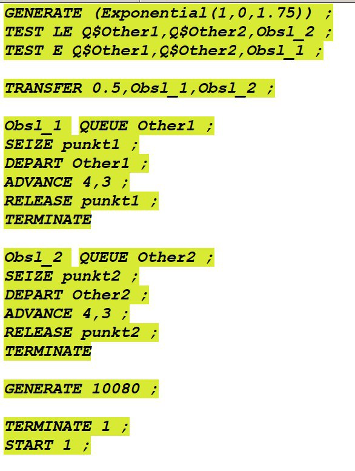{#fig:001 width=35%}

## Результат моделирования для первой стратегии обслуживания 

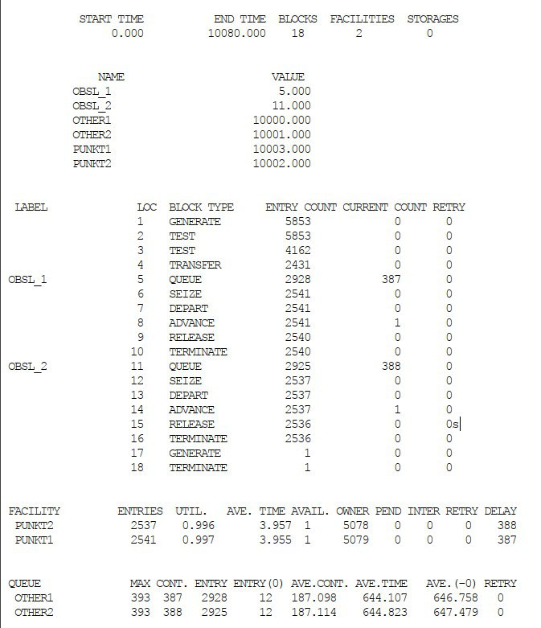{#fig:002 width=35%}

## 2. Cоставили модель для второй стратегии обслуживания, когда прибывающие автомобили образуют одну очередь и обслуживаются освободившимся пропускным пунктом;

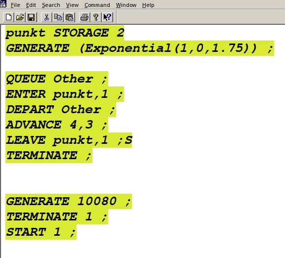{#fig:003 width=50%}

## Результат моделирования для второй стратегии обслуживания 

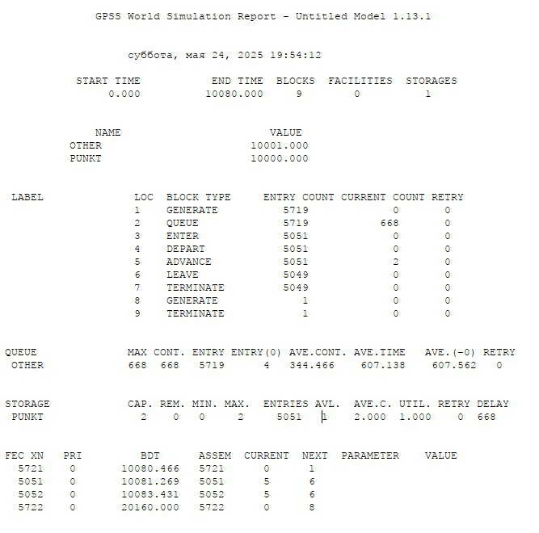{#fig:004 width=50%}

## 3. Cвели полученные статистики моделирования в таблицу 

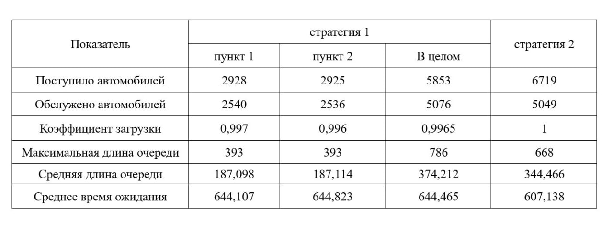{#fig:005 width=50%}

## 4. По результатам моделирования сделали вывод, что наилучшей стратегией обслуживания автомобилей является "стратегия 2".

{#fig:005 width=50%}

## 5. Изменив модели, определили оптимальное число пропускных пунктов (от 1 до 4):

Для первой стратегии - 4
Для второй стратегии - 3 

## Составили модель для первой стратегии обслуживания, когда прибывающие автомобили образуют две очереди и обслуживаются одним пропускным пунктом

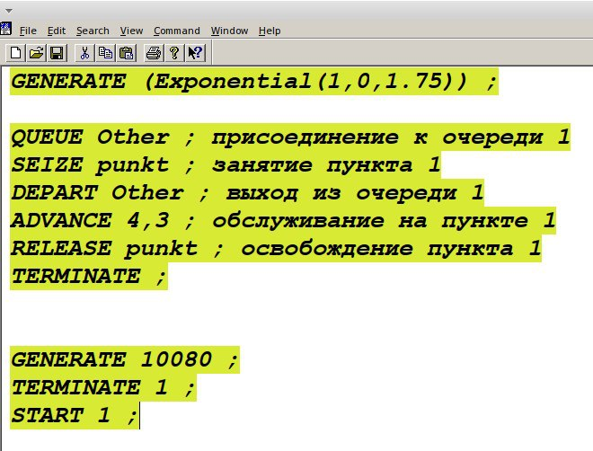{#fig:006 width=50%}

## Результат моделирования для первой стратегии обслуживания с одним пропускным пунктом

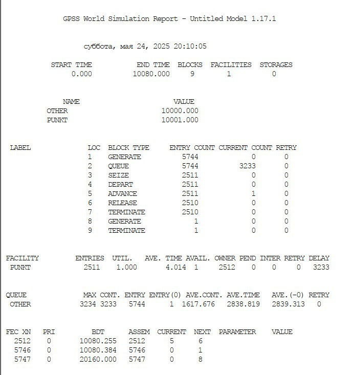{#fig:007 width=40%}

## Составили модель для первой стратегии обслуживания, когда прибывающие автомобили образуют две очереди и обслуживаются тремя пропускными пунктами

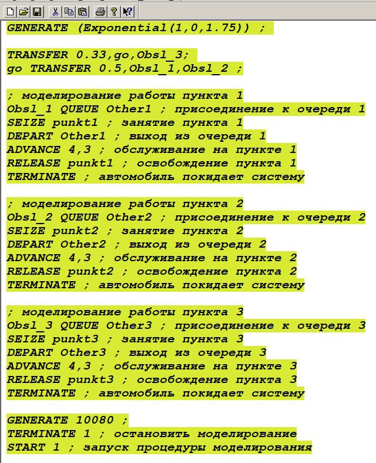{#fig:008 width=35%}

## Результат моделирования для первой стратегии обслуживания с тремя пропускными пунктами

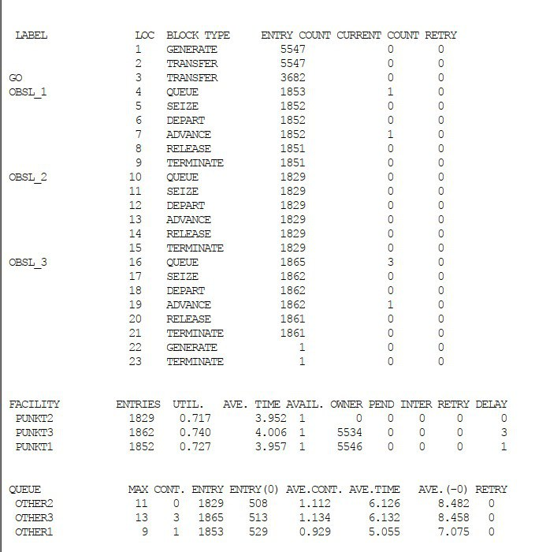{#fig:009 width=35%}

## Составили модель для первой стратегии обслуживания, когда прибывающие автомобили образуют две очереди и обслуживаются четырьмя пропускными пунктами

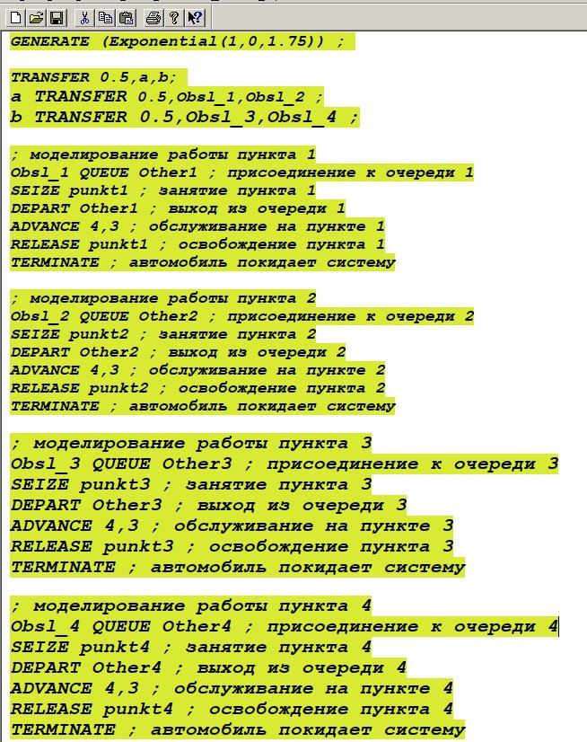{#fig:010 width=35%}

## Результат моделирования для первой стратегии обслуживания с тремя пропускными пунктами

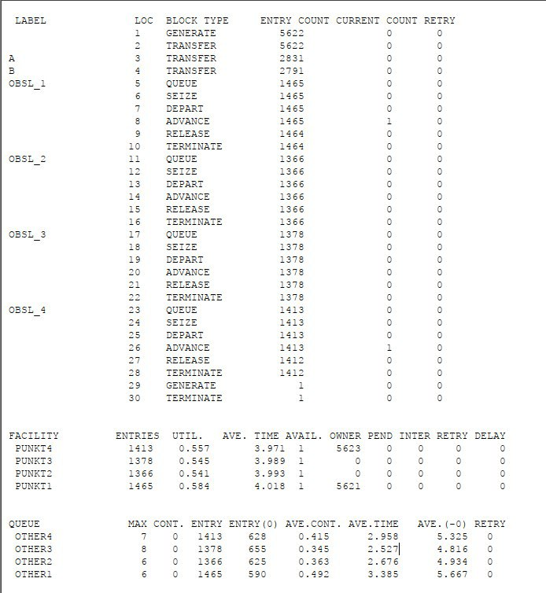{#fig:011 width=35%}

## Составили модель для второй стратегии обслуживания, когда прибывающие автомобили образуют одну очередь и обслуживаются тремя пропускными пунктами

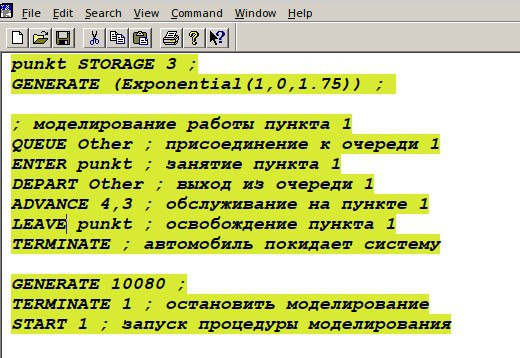{#fig:012 width=50%}

## Результат моделирования для первой стратегии обслуживания с тремя пропускными пунктами

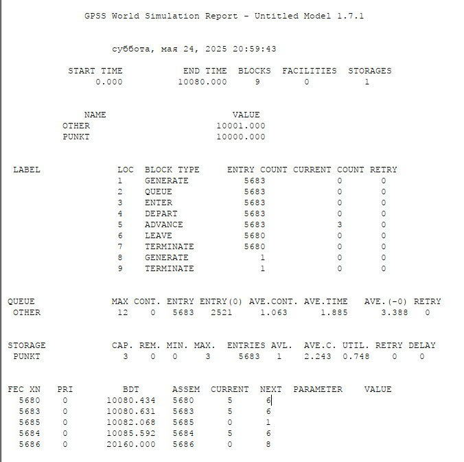{#fig:013 width=35%}

## Составили модель для второй стратегии обслуживания, когда прибывающие автомобили образуют одну очередь и обслуживаются четырьмя пропускными пунктами

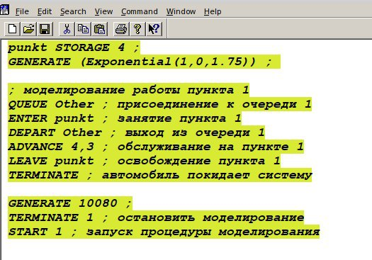{#fig:014 width=50%}

## Результат моделирования для первой стратегии обслуживания с тремя пропускными пунктами

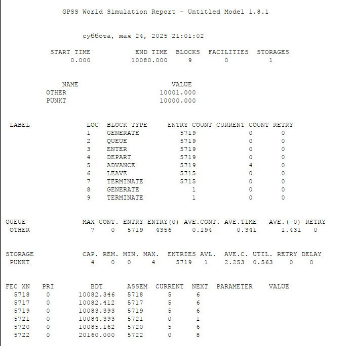{#fig:015 width=35%}

# Выводы

Определили:
1. характеристики качества обслуживания автомобилей, в частности, средних длин очередей; среднего времени обслуживания автомобиля; среднего времени пребывания автомобиля на пункте пропуска;
2. наилучшую стратегию обслуживания автомобилей на пункте пограничного контроля;
3. оптимальное количество пропускных пунктов.

# Список литературы{.unnumbered}
1. Постановка задачи оптимизации и численные методы ее решения [Электронный ресурс]. URL: https://hub.exponenta.ru/post/postanovka-zadachi-optimizatsii-i-chislennye-metody-ee-resheniya356 (дата обращения: 03.01.2023).
2. Применение многомерной математической модели для решения задачи оптимизации стратегии технического обслуживания сложных систем [Электронный ресурс]. URL: https://infourok.ru/primenenie-mnogomernoy-matematicheskoy-modeli-dlya-resheniya-zadachi-optimizacii-strategii-tehnicheskogo-obsluzhivaniya-slozhnih-3534388.html (дата обращения: 03.01.2023).
3. Бикритериальные задачи оптимизации обслуживания линейно-рассредоточенной группировки стационарных объектов [Электронный ресурс]. URL: https://cyberleninka.ru/article/n/bikriterialnye-zadachi-optimizatsii-obsluzhivaniya-lineyno-rassredotochennoy-gruppirovki-statsionarnyh-obektov (дата обращения: 03.01.2023).
4. Таненбаум Э., Бос Х. Современные операционные системы. 4-е изд. СПб.: Питер, 2015. 1120 с. (Классика Computer Science).
5. Robbins A. Bash Pocket Reference. O'Reilly Media, 2016. 156 p.
