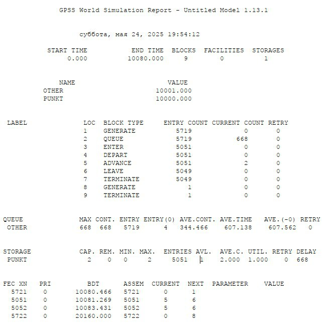
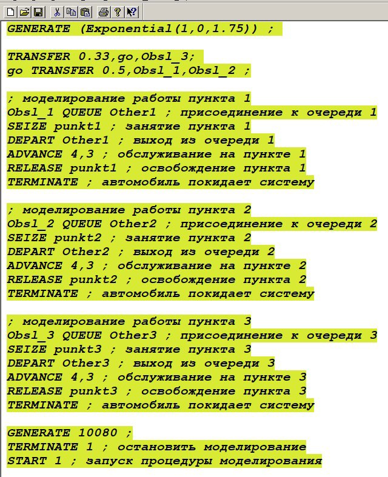
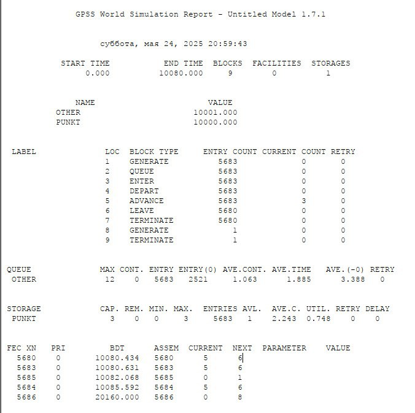
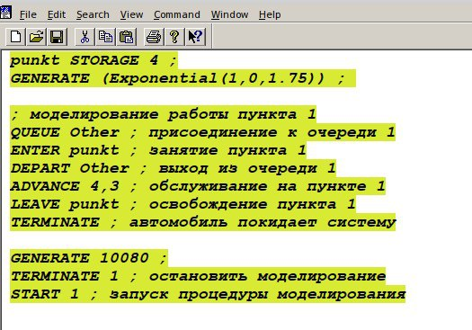

---
## Front matter
title: "Отчет по Лабораторной работе №16"
subtitle: "Дисциплина: Имитационное моделирование"
author: "Шошина Евгения Александровна, НФИ-01-22"

## Generic otions
lang: ru-RU
toc-title: "Содержание"

## Bibliography
bibliography: bib/cite.bib
csl: pandoc/csl/gost-r-7-0-5-2008-numeric.csl

## Pdf output format
toc: true # Table of contents
toc-depth: 2
lof: true # List of figures
lot: true # List of tables
fontsize: 12pt
linestretch: 1.5
papersize: a4
documentclass: scrreprt
## I18n polyglossia
polyglossia-lang:
  name: russian
  options:
	- spelling=modern
	- babelshorthands=true
polyglossia-otherlangs:
  name: english
## I18n babel
babel-lang: russian
babel-otherlangs: english
## Fonts
mainfont: PT Serif
romanfont: PT Serif
sansfont: PT Sans
monofont: PT Mono
mainfontoptions: Ligatures=TeX
romanfontoptions: Ligatures=TeX
sansfontoptions: Ligatures=TeX,Scale=MatchLowercase
monofontoptions: Scale=MatchLowercase,Scale=0.9
## Biblatex
biblatex: true
biblio-style: "gost-numeric"
biblatexoptions:
  - parentracker=true
  - backend=biber
  - hyperref=auto
  - language=auto
  - autolang=other*
  - citestyle=gost-numeric
## Pandoc-crossref LaTeX customization
figureTitle: "Рис."
tableTitle: "Таблица"
listingTitle: "Листинг"
lofTitle: "Список иллюстраций"
lotTitle: "Список таблиц"
lolTitle: "Листинги"
## Misc options
indent: true
header-includes:
  - \usepackage{indentfirst}
  - \usepackage{float} # keep figures where there are in the text
  - \floatplacement{figure}{H} # keep figures where there are in the text
---

# Цель работы

Определить:
- характеристики качества обслуживания автомобилей, в частности, средних длин очередей; среднего времени обслуживания автомобиля; среднего времени пребывания автомобиля на пункте пропуска;
- наилучшую стратегию обслуживания автомобилей на пункте пограничного контроля;
- оптимальное количество пропускных пунктов.

# Задание
1. Cоставить модель для первой стратегии обслуживания, когда прибывающие автомобили образуют две очереди и обслуживаются соответствующими пропускными пунктами, имеем следующую модель
2. Cоставить модель для второй стратегии обслуживания, когда прибывающие автомобили образуют одну очередь и обслуживаются освободившимся пропускным пунктом;
3. Cвести полученные статистики моделирования в таблицу 
4. По результатам моделирования сделать вывод о наилучшей стратегии обслуживания автомобилей;
5. Изменив модели, определить оптимальное число пропускных пунктов (от 1 до 4) для каждой стратегии при условии, что:
- коэффициент загрузки пропускных пунктов принадлежит интервалу [0, 5; 0, 95];
- среднее число автомобилей, одновременно находящихся на контрольно-пропускном пункте, не должно превышать 3;
- среднее время ожидания обслуживания не должно превышать 4 мин

# Теоретическое введение
Для первой стратегии обслуживания, когда прибывающие автомобили образуют две очереди и обслуживаются соответствующими пропускными пунктами, имеем следующую модель:
```GENERATE (Exponential(1,0,1.75)) ; прибытие автомобилей
TEST LE Q$Other1,Q$Other2,Obsl_2 ; длина оч. 1<= длине оч. 2
TEST E Q$Other1,Q$Other2,Obsl_1 ; длина оч. 1= длине оч. 2
TRANSFER 0.5,Obsl_1,Obsl_2 ; длины очередей равны,
; выбираем произв. пункт пропуска
; моделирование работы пункта 1
Obsl_1 QUEUE Other1 ; присоединение к очереди 1
SEIZE punkt1 ; занятие пункта 1
DEPART Other1 ; выход из очереди 1
ADVANCE 4,3 ; обслуживание на пункте 1
RELEASE punkt1 ; освобождение пункта 1
TERMINATE ; автомобиль покидает систему

; моделирование работы пункта 2
Obsl_2 QUEUE Other2 ; присоединение к очереди 2
SEIZE punkt2 ; занятие пункта 2
DEPART Other2 ; выход из очереди 2
ADVANCE 4,3 ; обслуживание на пункте 2
RELEASE punkt2 ; освобождение пункта 2

TERMINATE ; автомобиль покидает систему
; задание условия остановки процедуры моделирования

GENERATE 10080 ; генерация фиктивного транзакта,
; указывающего на окончание рабочей недели
; (7 дней x 24 часа x 60 мин = 10080 мин)
TERMINATE 1 ; остановить моделирование
START 1 ; запуск процедуры моделирования
```

# Выполнение лабораторной работы

1. Составили модель для первой стратегии обслуживания, когда прибывающие автомобили образуют две очереди и обслуживаются соответствующими пропускными пунктами (рис. [-@fig:001]).

{#fig:001 width=50%}

Результат моделирования для первой стратегии обслуживания 

{#fig:002 width=50%}

2. Cоставили модель для второй стратегии обслуживания, когда прибывающие автомобили образуют одну очередь и обслуживаются освободившимся пропускным пунктом;(рис. [-@fig:003]).

{#fig:003 width=50%}

Результат моделирования для второй стратегии обслуживания 

{#fig:004 width=50%}

3. Cвели полученные статистики моделирования в таблицу (рис. [-@fig:005]).

{#fig:005 width=50%}

4. По результатам моделирования сделали вывод, что наилучшей стратегией обслуживания автомобилей является "стратегия 2".

5. Изменив модели, определили оптимальное число пропускных пунктов (от 1 до 4):

Для первой стратегии - 4
Для второй стратегии - 3 и 4

- Составили модель для первой стратегии обслуживания, когда прибывающие автомобили образуют две очереди и обслуживаются одним пропускным пунктом

{#fig:006 width=50%}

Результат моделирования для первой стратегии обслуживания с одним пропускным пунктом

{#fig:007 width=50%}

- Составили модель для первой стратегии обслуживания, когда прибывающие автомобили образуют две очереди и обслуживаются тремя пропускными пунктами

{#fig:008 width=50%}

Результат моделирования для первой стратегии обслуживания с тремя пропускными пунктами

{#fig:009 width=50%}

- Составили модель для первой стратегии обслуживания, когда прибывающие автомобили образуют две очереди и обслуживаются четырьмя пропускными пунктами

{#fig:010 width=50%}

Результат моделирования для первой стратегии обслуживания с тремя пропускными пунктами

{#fig:011 width=50%}

- Составили модель для второй стратегии обслуживания, когда прибывающие автомобили образуют одну очередь и обслуживаются тремя пропускными пунктами

{#fig:012 width=50%}

Результат моделирования для первой стратегии обслуживания с тремя пропускными пунктами

{#fig:013 width=50%}

- Составили модель для второй стратегии обслуживания, когда прибывающие автомобили образуют одну очередь и обслуживаются четырьмя пропускными пунктами

{#fig:014 width=50%}

Результат моделирования для первой стратегии обслуживания с тремя пропускными пунктами

{#fig:015 width=50%}


# Выводы

Определили:
- характеристики качества обслуживания автомобилей, в частности, средних длин очередей; среднего времени обслуживания автомобиля; среднего времени пребывания автомобиля на пункте пропуска;
- наилучшую стратегию обслуживания автомобилей на пункте пограничного контроля;
- оптимальное количество пропускных пунктов.

# Список литературы{.unnumbered}
1. Постановка задачи оптимизации и численные методы ее решения [Электронный ресурс]. URL: https://hub.exponenta.ru/post/postanovka-zadachi-optimizatsii-i-chislennye-metody-ee-resheniya356 (дата обращения: 03.01.2023).
2. Применение многомерной математической модели для решения задачи оптимизации стратегии технического обслуживания сложных систем [Электронный ресурс]. URL: https://infourok.ru/primenenie-mnogomernoy-matematicheskoy-modeli-dlya-resheniya-zadachi-optimizacii-strategii-tehnicheskogo-obsluzhivaniya-slozhnih-3534388.html (дата обращения: 03.01.2023).
3. Бикритериальные задачи оптимизации обслуживания линейно-рассредоточенной группировки стационарных объектов [Электронный ресурс]. URL: https://cyberleninka.ru/article/n/bikriterialnye-zadachi-optimizatsii-obsluzhivaniya-lineyno-rassredotochennoy-gruppirovki-statsionarnyh-obektov (дата обращения: 03.01.2023).
4. Таненбаум Э., Бос Х. Современные операционные системы. 4-е изд. СПб.: Питер, 2015. 1120 с. (Классика Computer Science).
5. Robbins A. Bash Pocket Reference. O'Reilly Media, 2016. 156 p.
