---
## Front matter
lang: ru-RU
title: "Отчет по 17 лабораторной работе"
subtitle: "Дисциплина: Имитационное моделирование"
author:
  - Шошина Е.А.
institute:
  - Группа НФИбд-01-22
  - Российский университет дружбы народов, Москва, Россия
date: 31 мая 2025

## i18n babel
babel-lang: russian
babel-otherlangs: english

## Formatting pdf
toc: false
toc-title: Содержание
slide_level: 2
aspectratio: 169
section-titles: true
theme: metropolis
header-includes:
  - \metroset{progressbar=frametitle,sectionpage=progressbar,numbering=fraction}
  - '\makeatletter'
  - '\beamer@ignorenonframefalse'
  - '\makeatother'
---

# Информация

## Докладчик

:::::::::::::: {.columns align=center}
::: {.column width="70%"}

  * Шошина Евгения Александровна
  * Студентка 3го курса, группа НФИбд-01-22
  * Фундаментальная информатика и информационные технологии
  * Российский университет дружбы народов
  * [Ссылка на репозиторий гитхаба EAShoshina](https://github.com/eashoshina/study_2024-2025_simmod)

:::
::: {.column width="30%"}

:::
::::::::::::::

## Цель работы

Выполнить задания для самостоятельной работы.

## Задание

1. Смоделировать работу вычислительного центра.
2. Построить модель работы аэропорта
3. Смоделировать работу морского порта

# Теоретическое введение
## 17.1. Моделирование работы вычислительного центра
На вычислительном центре в обработку принимаются три класса заданий А, В и С.
Исходя из наличия оперативной памяти ЭВМ задания классов А и В могут решаться одновременно, а задания класса С монополизируют ЭВМ. Задания класса А поступают через 20 ± 5 мин, класса В — через 20 ± 10 мин, класса С — через 28 ± 5 мин и требуют для выполнения: класс А — 20 ± 5 мин, класс В — 21 ± 3 мин, класс С — 28 ± 5 мин. Задачи класса С загружаются в ЭВМ, если она полностью свободна.
Задачи классов А и В могут дозагружаться к решающей задаче.
Смоделировать работу ЭВМ за 80 ч. Определить её загрузку.

## 17.2. Модель работы аэропорта
Самолёты прибывают для посадки в район аэропорта каждые 10 ± 5 мин. Если взлетно- посадочная полоса свободна, прибывший самолёт получает разрешение на посадку. Если полоса занята, самолет выполняет полет по кругу и возвращается в аэропорт каждые 5 мин. Если после пятого круга самолет не получает разрешения на посадку, он отправляется на запасной аэродром.
В аэропорту через каждые 10 ± 2 мин к взлетно -посадочной полосе выруливают готовые к взлёту самолёты и получают разрешение на взлёт, если полоса свободна. Для взлета и посадки самолёты занимают полосу ровно на 2 мин. Если при свободной полосе одновременно один самолёт прибывает для посадки, а другой — для взлёта, то полоса предоставляется взлетающей машине.

## 17.2. Модель работы аэропорта
Требуется:
- выполнить моделирование работы аэропорта в течение суток;
- подсчитать количество самолётов, которые взлетели, сели и были направлены на запасной аэродром;
- определить коэффициент загрузки взлетно-посадочной полосы.

## 17.3. Моделирование работы морского порта
Морские суда прибывают в порт каждые [a ± δ] часов. В порту имеется N причалов. Каждый корабль по длине занимает M причалов и находится в порту [b ± ε] часов. Требуется построить GPSS-модель для анализа работы морского порта в течение полугода, определить оптимальное количество причалов для эффективной работы порта.

## 17.3. Моделирование работы морского порта. Исходные данные:
1. a = 20 ч, δ = 5 ч, b = 10 ч, ε = 3 ч, N = 10, M = 3;
2. a = 30 ч, δ = 10 ч, b = 8 ч, ε = 4 ч, N = 6, M = 2.

# Выполнение лабораторной работы
## 17.1. Моделирование работы вычислительного центра 

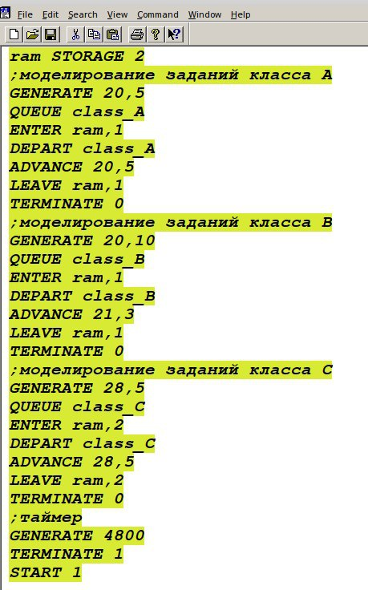{#fig:001 width=35%}

## 17.1. Моделирование работы вычислительного центра 

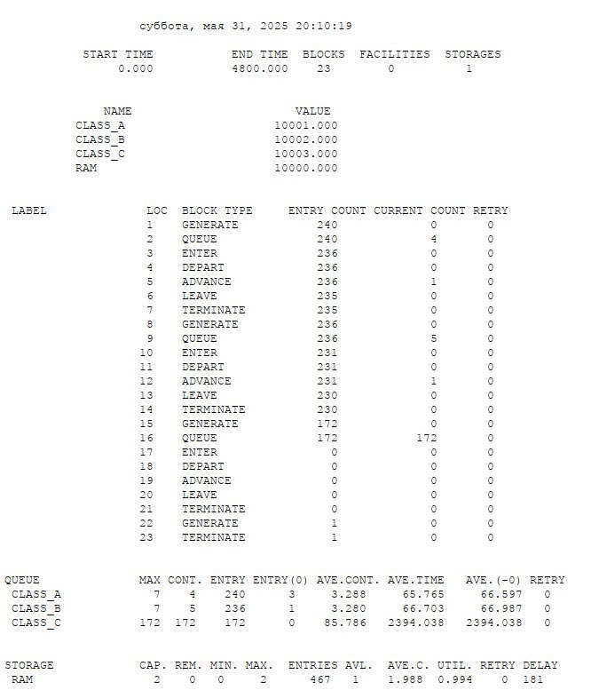{#fig:002 width=35%}

## 17.2. Модель работы аэропорта

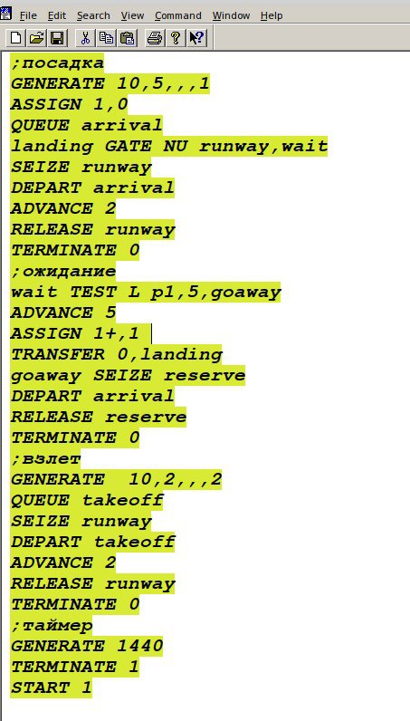{#fig:003 width=35%}

## 17.2. Модель работы аэропорта
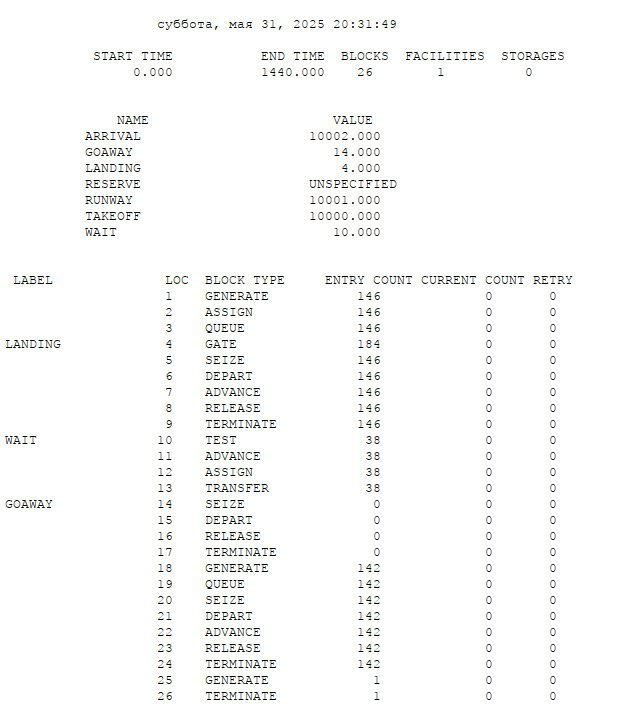{#fig:004 width=40%}

## 17.3. Моделирование работы морского порта, при a = 20 ч, δ = 5 ч, b = 10 ч, ε = 3 ч, N = 10, M = 3;

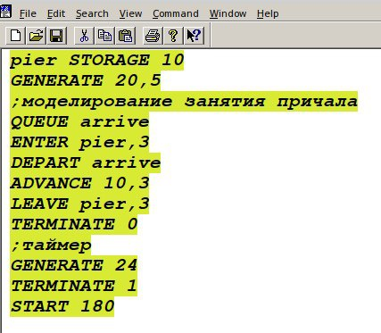{#fig:005 width=50%}

## 17.3. Моделирование работы морского порта
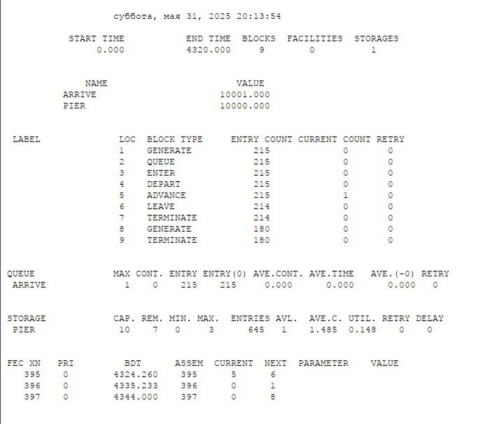{#fig:006 width=50%}

## 17.3. Моделирование работы морского порта, при a = 30 ч, δ = 10 ч, b = 8 ч, ε = 4 ч, N = 6, M = 2.

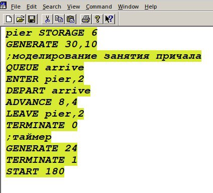{#fig:007 width=50%}

## 17.3. Моделирование работы морского порта
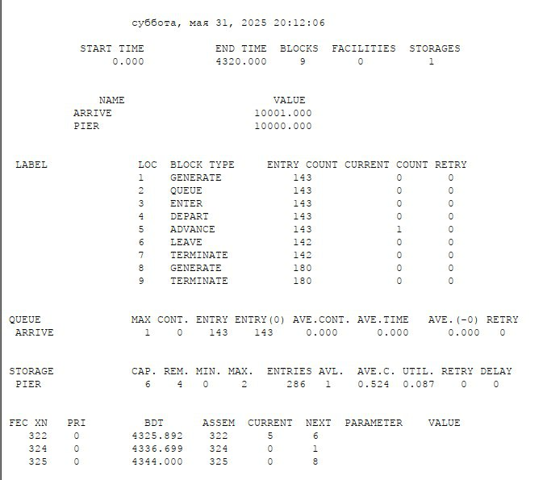{#fig:008 width=50%}

# Поиск оптимального количества причалов для эффективной работы порта.
## 17.3. Моделирование работы морского порта, при a = 20 ч, δ = 5 ч, b = 10 ч, ε = 3 ч, N = 3, M = 3;
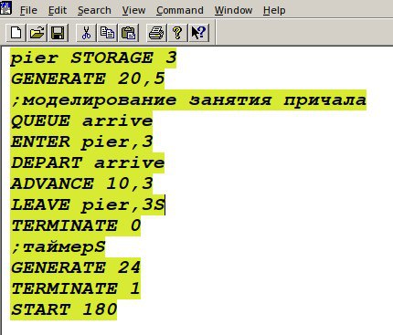{#fig:009 width=50%}

## 17.3. Моделирование работы морского порта
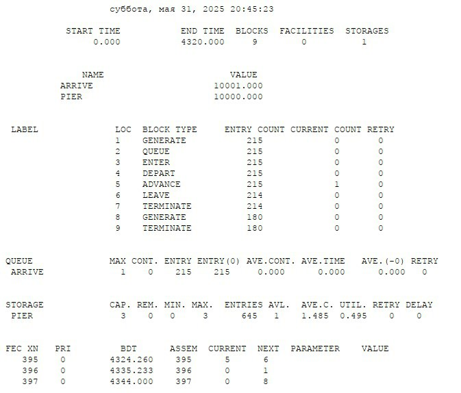{#fig:010 width=50%}

## 17.3. Моделирование работы морского порта, при a = 30 ч, δ = 10 ч, b = 8 ч, ε = 4 ч, N = 2, M = 2.
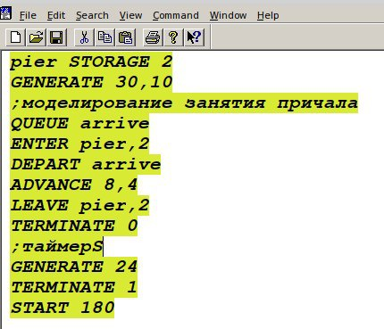{#fig:011 width=50%}

## 17.3. Моделирование работы морского порта
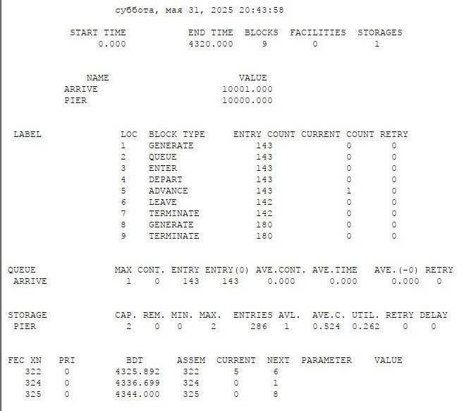{#fig:012 width=50%}

## Выводы

Выполнили задания для самостоятельной работы.

## Список литературы

1. https://s5.hpc.name/thread/q202/92252/modelirovanie-raboty-vychislitelnogo-centra-na-anylogic.html
2. https://cyberleninka.ru/article/n/modelirovanie-raboty-sistemy-sostoyaschey-iz-dvuh-vzaimozamenyaemyh-ustroystv
3. https://rs-class.org/nts/sbornik-5455-2019/imitatsionnoe-modelirovanie-kak-instrument-otsenki-vliyaniya-vmestimosti-sklada-morskogo-porta-na-ka/

