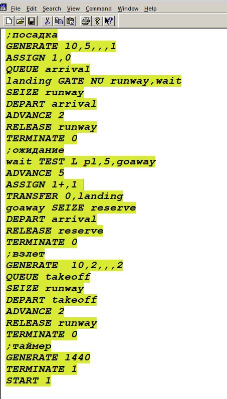
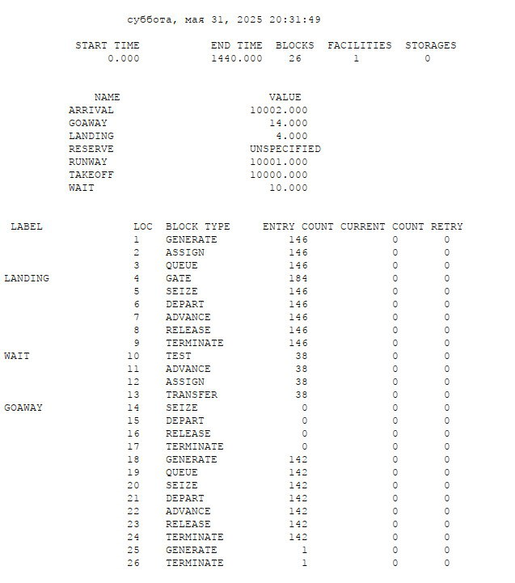

# Цель работы

Выполнить задания для самостоятельной работы.

# Задание

1. Смоделировать работу вычислительного центра.
2. Построить модель работы аэропорта
3. Смоделировать работу морского порта

# Теоретическое введение
## 17.1. Моделирование работы вычислительного центра
На вычислительном центре в обработку принимаются три класса заданий А, В и С.
Исходя из наличия оперативной памяти ЭВМ задания классов А и В могут решаться одновременно, а задания класса С монополизируют ЭВМ. Задания класса А поступают через 20 ± 5 мин, класса В — через 20 ± 10 мин, класса С — через 28 ± 5 мин и требуют для выполнения: класс А — 20 ± 5 мин, класс В — 21 ± 3 мин, класс С — 28 ± 5 мин. Задачи класса С загружаются в ЭВМ, если она полностью свободна.
Задачи классов А и В могут дозагружаться к решающей задаче.
Смоделировать работу ЭВМ за 80 ч. Определить её загрузку.

## 17.2. Модель работы аэропорта
Самолёты прибывают для посадки в район аэропорта каждые 10 ± 5 мин. Если взлетно- посадочная полоса свободна, прибывший самолёт получает разрешение на посадку. Если полоса занята, самолет выполняет полет по кругу и возвращается в аэропорт каждые 5 мин. Если после пятого круга самолет не получает разрешения на посадку, он отправляется на запасной аэродром.
В аэропорту через каждые 10 ± 2 мин к взлетно -посадочной полосе выруливают готовые к взлёту самолёты и получают разрешение на взлёт, если полоса свободна. Для взлета и посадки самолёты занимают полосу ровно на 2 мин. Если при свободной полосе одновременно один самолёт прибывает для посадки, а другой — для взлёта, то полоса предоставляется взлетающей машине.
Требуется:
- выполнить моделирование работы аэропорта в течение суток;
- подсчитать количество самолётов, которые взлетели, сели и были направлены на запасной аэродром;
- определить коэффициент загрузки взлетно-посадочной полосы.

## 17.3. Моделирование работы морского порта
Морские суда прибывают в порт каждые [a ± δ] часов. В порту имеется N причалов. Каждый корабль по длине занимает M причалов и находится в порту [b ± ε] часов. Требуется построить GPSS-модель для анализа работы морского порта в течение полугода, определить оптимальное количество причалов для эффективной работы порта.
Исходные данные:
1. a = 20 ч, δ = 5 ч, b = 10 ч, ε = 3 ч, N = 10, M = 3;
2. a = 30 ч, δ = 10 ч, b = 8 ч, ε = 4 ч, N = 6, M = 2.

# Выполнение лабораторной работы

## 17.1. Моделирование работы вычислительного центра 

{#fig:001 width=60%}

{#fig:002 width=60%}

**Загрузка модели вычислительного центра = 0.994**

## 17.2. Модель работы аэропорта
{#fig:003 width=60%}

{#fig:004 width=60%}

**количество самолётов, которые взлетели: 142, сели 146 самолетов и были направлены на запасной аэродром 0 самолетов;**
**коэффициент загрузки взлетно-посадочной полосы = 0.400**

## 17.3. Моделирование работы морского порта
1. При a = 20 ч, δ = 5 ч, b = 10 ч, ε = 3 ч, N = 10, M = 3;

{#fig:005 width=60%}

{#fig:006 width=60%}

2. При a = 30 ч, δ = 10 ч, b = 8 ч, ε = 4 ч, N = 6, M = 2.

{#fig:007 width=60%}

{#fig:008 width=60%}

### Поиск оптимального количества причалов для эффективной работы порта.

1. При a = 20 ч, δ = 5 ч, b = 10 ч, ε = 3 ч, N = 3, M = 3;

{#fig:009 width=60%}

{#fig:010 width=60%}

2. При a = 30 ч, δ = 10 ч, b = 8 ч, ε = 4 ч, N = 2, M = 2.

{#fig:011 width=60%}

{#fig:012 width=60%}

# Выводы

Выполнили задания для самостоятельной работы.

# Список литературы{.unnumbered}

1. https://s5.hpc.name/thread/q202/92252/modelirovanie-raboty-vychislitelnogo-centra-na-anylogic.html
2. https://cyberleninka.ru/article/n/modelirovanie-raboty-sistemy-sostoyaschey-iz-dvuh-vzaimozamenyaemyh-ustroystv
3. https://rs-class.org/nts/sbornik-5455-2019/imitatsionnoe-modelirovanie-kak-instrument-otsenki-vliyaniya-vmestimosti-sklada-morskogo-porta-na-ka/
